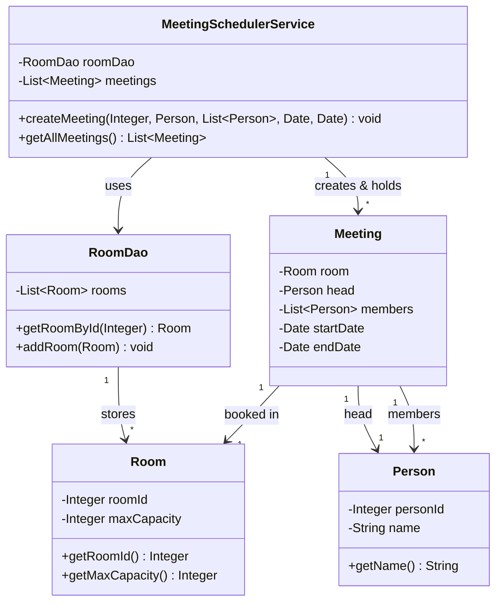
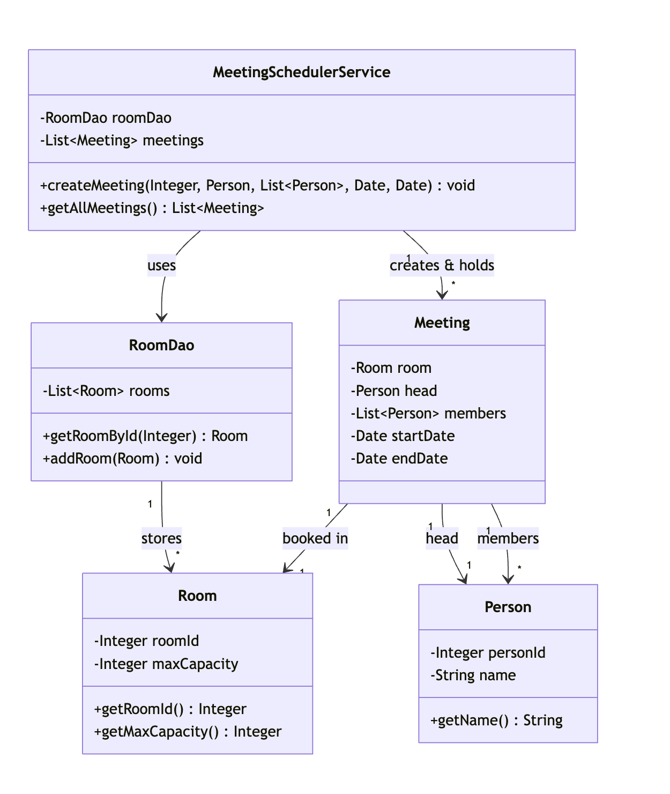
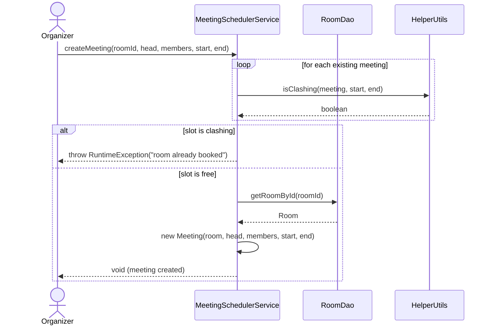
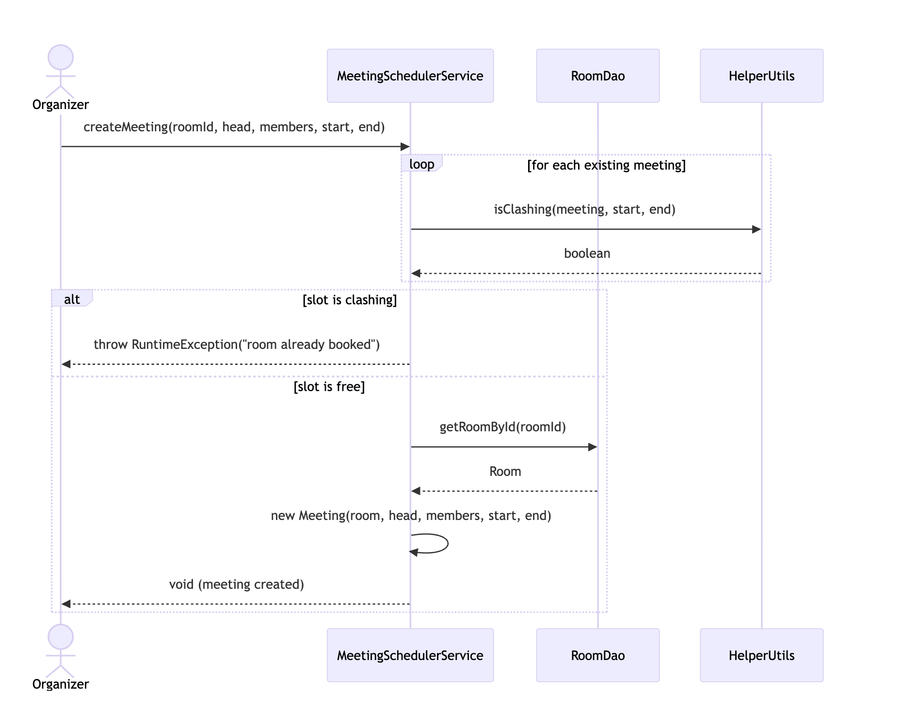
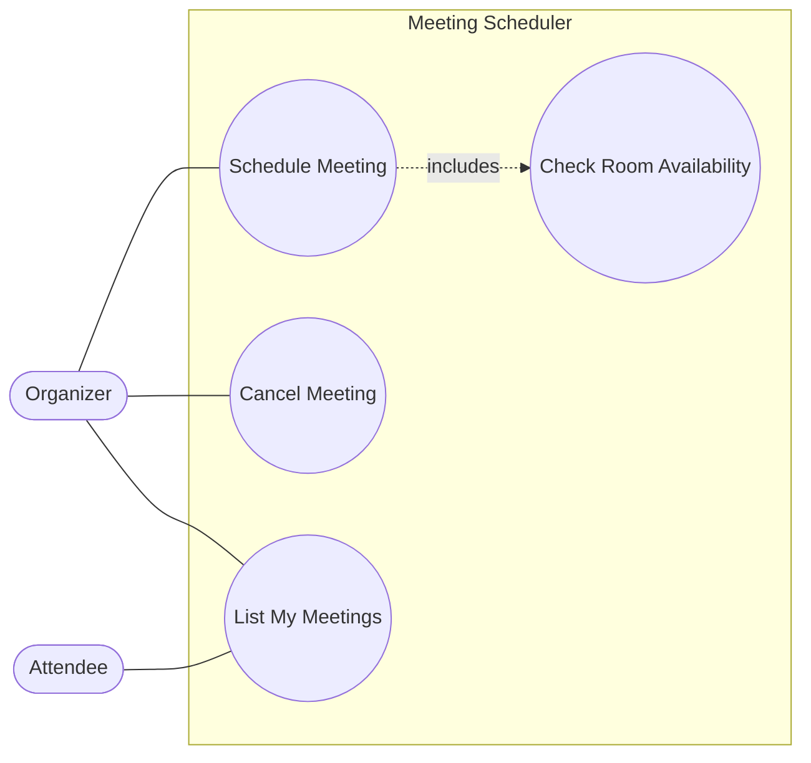
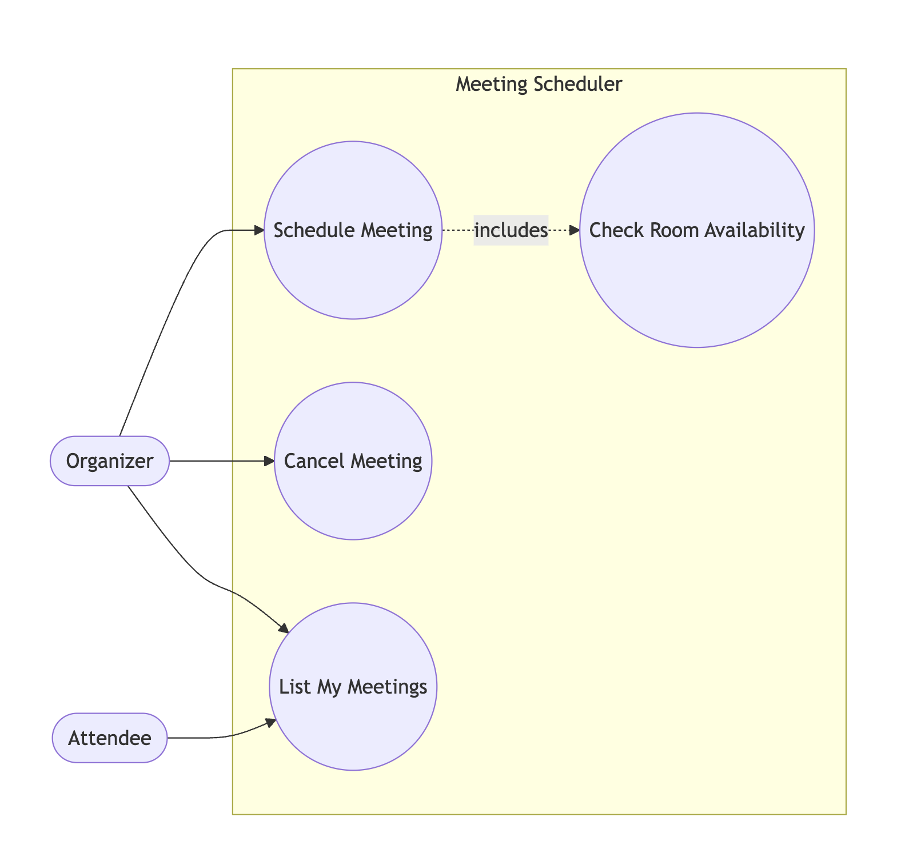

# UML Diagrams (practice drawing these live, not just reading them)

An LLD interview isn't graded on whether you know UML notation exists — it's graded on whether you can put a
correct diagram on a whiteboard/doc *while talking*, in real time, without pausing to look up arrow syntax. Read
this once, then practice actually drawing each diagram for one of the designs in this repo (or one from
`TODO.md`'s problem list) without referencing your notes.

## 1. Class diagram

The one you'll draw in almost every round — it *is* the design. Gets it right and the rest of the interview (code,
edge cases) falls out of it naturally; get the relationships wrong and everything downstream inherits the mistake.

**Notation — relationship types, weakest to strongest coupling:**

| Relationship | Meaning | Arrow (UML) | Example in this repo |
|---|---|---|---|
| Association | "uses" — a general relationship, may not even hold a reference | plain line | `MeetingSchedulerService` *uses* `HelperUtils` to check clashes |
| Aggregation | "has-a," but the parts can outlive the whole | line + hollow diamond at the owner | `Meeting` has `List<Person> members` — people exist independently of any one meeting |
| Composition | "has-a," and the parts' lifecycle is owned by the whole (destroy the whole, destroy the parts) | line + filled diamond at the owner | `loggingsystem`'s chain: a `DebugLogProcessor` owns its `next` processor reference — but see note below |
| Inheritance (generalization) | "is-a" | line + hollow triangle, pointing at the parent | `Snake`/`Ladder` → a common board-entity supertype (see `concepts/basic-oop-concepts.md` §2) |
| Realization | "implements the contract of" | dashed line + hollow triangle | `DebugLogProcessor` ⇢ `LogProcessor`; `UserDaoImpl` ⇢ `UserDao` |

**Multiplicity notation:** `1`, `0..1`, `*` (or `0..*`), `1..*` — written at each end of the line, read from the
far end. `Room "1" —— "0..*" Meeting` reads "one Room is associated with zero-or-more Meetings."

**Worked example — Meeting Scheduler (`com.shubham.app.meetingscheduler`):**

**Interview tip:** draw the *nouns* (entities) first with just their names, connect the relationships, and only
then go back and fill in fields/methods on each box. Trying to fully spec one class before drawing the next one is
the most common way to run out of time on the diagram itself.

## 2. Sequence diagram

Shows *one specific flow* over time — which object calls which method on which other object, in order. Use it to
prove the class diagram actually supports the primary use case (this is the "walk through the primary flow" step
in `TODO.md`'s Answer Framework, made visual).

**Notation:**

| Element | Meaning |
|---|---|
| Actor/object (box at top) | A participant; lifeline is the dashed vertical line hanging below it |
| Solid arrow, filled head | Synchronous call (caller waits for the callee) |
| Dashed arrow, open head | Return value |
| Activation bar (thin rectangle on a lifeline) | The object is actively executing during that span |
| `alt`/`else` box | Conditional branch (e.g. success vs. failure path) |

**Worked example — scheduling a meeting (`MeetingSchedulerService.createMeeting`):**

**Interview tip:** keep it to *one* flow at a time. If asked about a second flow (e.g. "what about cancelling a
meeting?"), draw a second, separate sequence diagram rather than folding both into one — same rule the sibling
`system-design` repo uses for splitting success/failure paths into separate diagrams applies here too.

## 3. Use case diagram

The coarsest-grained diagram — actors and *what* they can do with the system, not *how*. Rarely the centerpiece of
an LLD round, but useful in the first two minutes to nail down scope with the interviewer before you start naming
classes.

**Notation:**

| Element | Shape | Meaning |
|---|---|---|
| Actor | Stick figure | A role interacting with the system (person or external system) |
| Use case | Ellipse | A discrete thing an actor can do |
| System boundary | Rectangle enclosing the use cases | What's *in scope* — actors sit outside it |
| `<<include>>` | Dashed arrow, open head | One use case always triggers another (mandatory sub-flow) |
| `<<extend>>` | Dashed arrow, open head | One use case optionally triggers another (conditional sub-flow) |

**Worked example — Meeting Scheduler:**

(Mermaid has no first-class use-case diagram type, so this is drawn as a boundary-and-nodes flowchart — on an
actual whiteboard/interview doc, use real stick-figure actors and ellipse use cases per the notation table above.)

**Interview tip:** this diagram answers *scope* questions — "can an Attendee cancel a meeting?" should be
answerable by looking at which actor has a line into which use case. If you can't answer a scope question from your
own diagram, the diagram is incomplete, not just the conversation.

## One-paragraph summary

Class diagrams capture structure (entities + relationship strength: association → aggregation → composition →
inheritance → realization) and should be drawn nouns-first, relationships-second, details-last. Sequence diagrams
capture one flow's behavior over time and double as a correctness check on the class diagram — draw one flow at a
time. Use case diagrams capture scope (who can do what) and are most useful in the first few minutes of an
interview to lock down requirements before any class gets named. All three are muscle-memory skills: read the
notation once, then rehearse drawing them against the problems in `TODO.md`'s "Classic LLD/OOD problems" list.
