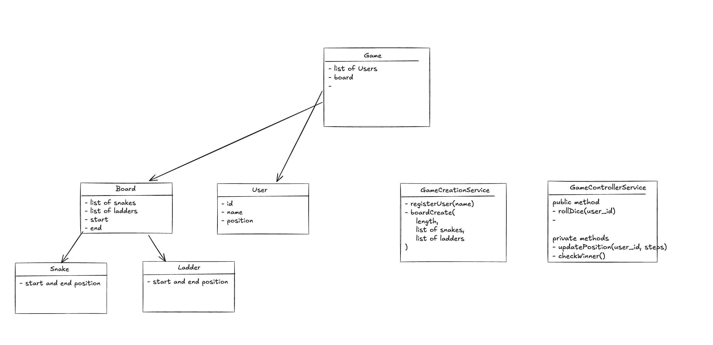
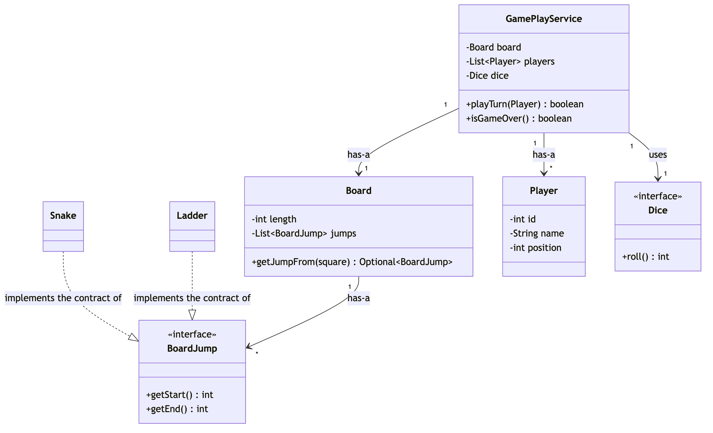
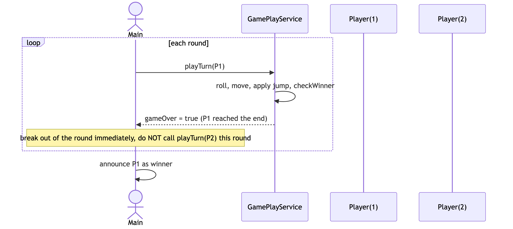

# LLD Practice — Mock Interview Log

Mirrors the sibling `system-design` repo's
[`practice/README.md`](https://github.com/ShubhamChouksey123/system-design/blob/master/practice/README.md) —
same shape (honest post-mortem + scorecard + reference "ideal design" + drillable takeaways), adapted for
LLD/OOD rounds instead of architecture rounds. The five scored axes below are this repo's LLD equivalent of that
tracker's fixed axes, mapped onto [`concepts/answer-framework.md`](../concepts/answer-framework.md)'s 8 steps.
Log every future mock here as a new row + a new `## Session NN` section — that aggregation is the point.

## Sessions

| # | Problem | Requirements & Entities | Class Diagram | Pattern Choice | Implementation & Exceptions | Correctness (Walkthrough) | Overall | Verdict |
|---|---|:---:|:---:|:---:|:---:|:---:|:---:|---|
| 01 | Snake and Ladder | 5/10 | 5/10 | 2/10 | 5/10 | 2/10 | **4/10** | ❌ Needs work |

Verdict thresholds (same as the sibling tracker): ✅ Pass ≥ 7 · ⚠️ Borderline 5.5–6.9 · ❌ Needs work < 5.5.

---

## Session 01 — Snake and Ladder (LLD/OOD) · 4/10

> Core mechanics work end-to-end on the happy path (board creation, dice rolls, snake/ladder jumps, winner
> detection), which is real credit. But the design skipped pattern selection entirely despite an obvious hook,
> and skipping the primary-flow walkthrough let a genuine crash bug ship — the two weakest areas below.

**Problem:** Design Snake and Ladder · **Focus:** class design, no architecture/scale concerns · **Overall:** 4/10
· **Weakest areas:** Pattern Choice, Correctness/Walkthrough · **Artifacts:**
[`SnakeLadderApplication.java`](../src/main/java/com/shubham/app/snakeladder2/practice/SnakeLadderApplication.java),
[entity/](../src/main/java/com/shubham/app/snakeladder2/practice/entity/),
[service/](../src/main/java/com/shubham/app/snakeladder2/practice/service/),
[class-diagram.png](../src/main/java/com/shubham/app/snakeladder2/practice/diagrams/class-diagram.png)

## The problem

> - Users should be able to register for a game
> - User should be able to create a custom board with different snakes and ladders
> - User should be able to roll a dice and move to the new position
> - A winner should be decided based on the player reaching the end position first

What it really tests: whether "snake" and "ladder" get recognized as *the same underlying concept* (a directed
jump between two squares) rather than two parallel special cases — and whether the turn loop is traced carefully
enough to survive more than one player.

## Requirements & entities gathered

What was produced: 4 clear, verb-based functional requirements, and an entity list (`Game`, `User`, `Board`,
`Snake`, `Ladder`, `GameCreationService`, `GameControllerService`).

Gaps against [step ① and ②](../concepts/answer-framework.md#-requirements--scope) of the framework:
no actors named explicitly, no out-of-scope list, and no one-sentence responsibility per entity — just a nested
list. Writing that sentence for `GameCreationService` (which both builds the board *and* registers users) would
likely have surfaced the SRP split on its own.

## The design produced



- `Game` — has-a `List<User>`, has-a `Board`.
- `Board` — has-a `List<Snake>`, has-a `List<Ladder>`.
- `GameCreationService` — creates the `Board` and registers `User`s onto a `Game`.
- `GameControllerService` — owns the turn loop: rolls dice, moves the player, checks for a winner.

The diagram uses plain arrows throughout (no aggregation/composition distinction, no multiplicities), and
`GameCreationService`/`GameControllerService` are drawn as floating boxes with **no relationship lines** to
`Game`, even though both classes operate on it directly in code.

## Scorecard

| Axis | Score /10 | Note |
|---|---|---|
| Requirements & Entities | 5/10 | Clear functional reqs; missing out-of-scope + per-entity responsibility sentences |
| Class Diagram & Relationships | 5/10 | Diagram exists; no relationship types/multiplicities; services disconnected from the entities they operate on |
| Pattern Choice & Justification | 2/10 | No pattern chosen anywhere, despite Snake/Ladder being a textbook Strategy/common-interface case |
| Implementation & Exception Handling | 5/10 | Clean signatures, but fully mutable entities, no validation, one dead statement |
| Correctness (Primary-Flow Walkthrough) | 2/10 | No walkthrough was done; a straightforward 2-player trace finds an uncaught crash |
| **Overall** | **4/10** | First session logged — no previous-session delta to show yet |

## What lost points — and the fix

| What I missed | The senior answer | Study link |
|---|---|---|
| Snake and Ladder modeled as two unrelated classes, driving two duplicated loops in `GameControllerService.java:54-65` | One `BoardJump` interface, `Snake`/`Ladder` as two implementations, one loop over one combined list — adding a third hazard type becomes additive, not another parallel loop | [`concepts/basic-oop-concepts.md`](../concepts/basic-oop-concepts.md#2-inheritance) §2, [`concepts/answer-framework.md`](../concepts/answer-framework.md#-pattern-choice--justification) §④ |
| `rollDice()` throws uncaught once *any* player wins, but the turn loop finishes the whole round first (`SnakeLadderApplication.java:59-63`) — a 2nd player's turn in the same round crashes the program | Have the turn method report game-over and `break` out of the round immediately, checked after *every* individual turn, not just between rounds | [`concepts/answer-framework.md`](../concepts/answer-framework.md#-primary-flow-walkthrough) §⑦ |
| Every entity field has a public setter with zero invariant checks (`Board.setEnd`, `User.setPosition`, ...) | Keep mutation behind intention-revealing methods when a class must be mutable at all; make fields effectively immutable where nothing needs to change them post-construction | [`concepts/basic-oop-concepts.md`](../concepts/basic-oop-concepts.md#1-encapsulation) §1 |
| `// add validations for snake and ladder` left as a comment in `GameCreationService.boardCreate` — no bounds/overlap checks, no custom exception type | Validate at construction (start/end ordering, in-range squares, no chained/overlapping jumps) and throw a named exception, e.g. `InvalidBoardConfigurationException` | [`concepts/answer-framework.md`](../concepts/answer-framework.md#-exception-handling) §⑥, `elevatorsystem`'s `InvalidFloorException` for the pattern to copy |
| A discarded `checkWinner(game);` call in `updatePosition` (`GameControllerService.java:52`) does nothing — it runs before the position update and its result is never used | Delete dead statements; if a call isn't gating a branch or feeding a return value, it doesn't belong in the method | [`concepts/design-principles.md`](../concepts/design-principles.md#kiss--keep-it-simple) — KISS |
| No stated position on concurrency or extensibility | Explicitly scope concurrency out for a single-threaded console game (say it, don't omit it); name one plausible new requirement and the one class you'd add for it | [`concepts/answer-framework.md`](../concepts/answer-framework.md#-concurrency--extensibility) §⑧ |

## What went well

- The full happy-path loop actually runs: board creation from user input, dice rolls, snake bites, ladder climbs,
  and single-winner detection all work correctly when the game happens to finish cleanly.
- The entity list correctly identified every noun in the problem statement — nothing structurally important is
  *missing* from the class diagram, the gaps are all in relationship/pattern/validation depth, not coverage.
- A class diagram was actually drawn before coding — many first attempts skip this step entirely.

---

## The ideal design

> **Implemented** in [`src/main/java/com/shubham/app/snakeladder2/ideal/`](../src/main/java/com/shubham/app/snakeladder2/ideal)
> — see that package's own [`README.md`](../src/main/java/com/shubham/app/snakeladder2/ideal/README.md) for the
> two small refinements that surfaced while actually writing the code (no separate board-setup service once
> `Board`'s own constructor validates itself; `Snake`/`Ladder` each validate their own jump direction).

**Framing sentence:** a snake and a ladder are the same abstraction — a directed jump from one square to
another — so the whole design should collapse to one polymorphic collection of jumps, not two parallel
hard-coded lists; the pattern choice, the duplicated-loop bug, and the extensibility story all follow from getting
that one abstraction right.

The rest of this section follows [`concepts/answer-framework.md`](../concepts/answer-framework.md)'s 8 steps in
order, the same structure `elevatorsystem/README.md` uses for its worked example.

### ① Functional Requirements & Scope

**Actors:** Player (same single actor as the original problem — no admin/spectator role).

**Operations:** register players, roll a die and advance a player's position, apply a board hazard if the new
position lands on one, decide a winner once a player reaches the last square.

**Explicitly out of scope:** any UI beyond the console, persistence between runs, and changing the board once a
game has started (no adding a snake mid-game). These weren't stated in Session 01 either — naming them here is
itself one of the fixes.

### ② Core Entities & Responsibilities

| Entity | Responsibility |
|---|---|
| `BoardJump` (interface) | The varying concept: a directed jump from one square to another (`getStart()`, `getEnd()`). |
| `Snake` / `Ladder` | Two interchangeable implementations of `BoardJump` — no other behavioral difference between them. |
| `Board` | Owns the board length and all `BoardJump`s; answers "is there a jump starting at square X?" |
| `Player` | id, name, current position. |
| `Dice` (interface) | Rolls a value — kept as its own abstraction so a test can inject a deterministic roll instead of `Random`. |
| `PlayerRegistrationService` | Registers `Player`s — the one half of `GameSetupService` that survived as its own class; board construction moved into `Board`'s own constructor instead (see the implementation note above). |
| `GamePlayService` | Owns the turn loop: roll → move → apply jump → check winner → report game-over. The *only* place that decides whether the game continues. |
| `InvalidBoardConfigurationException` | Thrown at board-construction time for invalid jump placement. |

### ③ Relationships & Class Diagram

Named per [`concepts/uml-diagrams.md`](../concepts/uml-diagrams.md#1-class-diagram)'s four categories:

- **Implements the contract of** — `Snake` and `Ladder` implement the contract of `BoardJump` (realization,
  dashed arrow). This is the relationship the whole design pivots on: it's what collapses the two duplicated
  loops from Session 01 into one.
- **Has-a** — `Board` has-a `List<BoardJump>` (composition; a jump doesn't make sense outside its board).
  `GamePlayService` has-a `Board` and has-a `List<Player>` (composition; the service owns the game's lifetime
  state — see the `owns` edges in the diagram below).
- **Uses** — `GamePlayService` uses a `Dice` (association, not composition): the dice is a swappable collaborator
  injected from outside, not state `GamePlayService` is responsible for the lifecycle of — which is exactly why
  `Dice` is an interface (a `FixedDice` can be swapped in for tests without `GamePlayService` changing).
- **Is-a** — deliberately absent as a class-extends relationship. `Snake`/`Ladder` share behavior through the
  `BoardJump` interface (realization) rather than a common abstract class, per the composition-over-inheritance
  default in [`concepts/basic-oop-concepts.md`](../concepts/basic-oop-concepts.md#2-inheritance) §2 — there's no
  genuine "is-a" hierarchy here, just two interchangeable implementations of one contract.

**Ideal class diagram:** source at
[`diagrams/session01-ideal-class-diagram.mmd`](diagrams/session01-ideal-class-diagram.mmd).



### ④ Pattern Choice & Justification

**Pattern used: Strategy Pattern — used twice.**

Put a behavior behind an interface, so the calling code can swap implementations without changing itself.

- **Board hazards:** `Board` only knows the `BoardJump` interface. `Snake` and `Ladder` are its two strategies —
  `Board` calls `getStart()`/`getEnd()` without caring which one it has. A new hazard type is one new class.
- **Dice rolls:** `GamePlayService` only knows the `Dice` interface. `RandomDice` is the real strategy;
  `FixedDice` is a second strategy used only in tests, so a test can fix the roll sequence instead of getting a
  random one.

### ⑤ Core Classes/Interfaces

Signatures only — getters and full implementations are in
[`src/main/java/com/shubham/app/snakeladder2/ideal/`](../src/main/java/com/shubham/app/snakeladder2/ideal):

```java
interface BoardJump { int getStart(); int getEnd(); }
class Snake implements BoardJump { Snake(int start, int end); }   // requires start > end
class Ladder implements BoardJump { Ladder(int start, int end); } // requires start < end

class Board {
    Board(int length, List<BoardJump> jumps);   // validates bounds + duplicate jump-start squares
    Optional<BoardJump> getJumpFrom(int square);
}

class Player {
    Player(int id, String name);
    void moveTo(int newPosition);
}

interface Dice { int roll(); }

class GamePlayService {
    GamePlayService(Board board, List<Player> players, Dice dice);
    boolean playTurn(Player player);   // returns true once this call ends the game
    boolean isGameOver();
}
```

### ⑥ Exception Handling

`Board`'s constructor validates every `BoardJump` — start/end within bounds, start ≠ end,
no two jumps starting on the same square — and throws `InvalidBoardConfigurationException` on the first violation,
naming which jump and why. `GamePlayService.playTurn` returns `false` once the game is already over instead of
throwing, so the caller decides what to do with a finished game rather than catching an exception for a routine
condition.

### ⑦ Primary-Flow Walkthrough — the actual fix for this session's bug

Source at
[`diagrams/session01-ideal-sequence-diagram.mmd`](diagrams/session01-ideal-sequence-diagram.mmd).



The fix is entirely in the caller's loop shape: check the boolean `playTurn` returns **after every individual
player's turn**, and `break` out of the round the moment it's `true` — not just between whole rounds. That one
change removes the crash this session's design would hit with 2+ players.

### ⑧ Concurrency & Extensibility

Single-threaded console game — concurrency is explicitly out of scope, stated
rather than left silent. Extensibility: a new hazard type is one new `BoardJump` implementation; a new dice shape
(a d20, a "roll twice, take higher" house rule) is one new `Dice` implementation. Neither touches
`GamePlayService`.

## Takeaways to drill

1. Before writing any loop that mutates shared game state across multiple actors, trace it by hand for **at least
   two actors per round** — this session's crash only shows up with 2+ players, which is exactly the scenario a
   30-second walkthrough would have exercised.
2. When two classes have the same method shape (`getStart()`/`getEnd()` on both `Snake` and `Ladder`) but no
   shared interface, that's the step ②/④ "flag the varying concept" moment — don't let it slide into two parallel
   loops.
3. Never leave a `// add validation` comment as the final state of a method — either implement it, or say out
   loud in the room "I'm scoping this out for time" so the interviewer knows it's a choice, not an oversight.
4. If a method call's return value is discarded and it isn't gating a branch, delete the call — it's dead code
   and it reads as confusion, not thoroughness.
5. Always be ready to answer "what's the one class you'd add for requirement X?" — this session couldn't answer
   that cheaply for a new hazard type, because step ④ was skipped.

> Rehearse this against [`concepts/answer-framework.md`](../concepts/answer-framework.md) before the next mock,
> and re-attempt this same problem once the fixes above are made — a re-solve against an already-known bug is a
> fast way to confirm the fix actually generalizes.

## Consolidated Tips (grouped by axis, weakest first)

- **Pattern Choice** `[S01]` — Actively ask "is there a concept in this problem that varies?" right after listing
  entities (step ②), before drawing the class diagram. Score history: 2/10.
- **Correctness (Walkthrough)** `[S01]` — Trace the primary flow with ≥2 actors, out loud, before writing code —
  don't rely on running the program once and eyeballing the output. Score history: 2/10.
- **Requirements & Entities** `[S01]` — Write the one-sentence responsibility per entity as you list it, not after.
  Score history: 5/10.
- **Class Diagram & Relationships** `[S01]` — Every service class must have at least one relationship line to the
  entities it operates on; an unconnected box is a diagram gap, not a style choice. Score history: 5/10.
- **Implementation & Exceptions** `[S01]` — Default to no setter unless something outside the constructor
  genuinely needs to mutate that field. Score history: 5/10.

## Recurring Action Items

None yet — this is the first logged session. Once a second session lands, promote any tip that repeats here
(tag it `[S01][S0N]`) so the pattern is visible across attempts rather than re-discovered each time.

## How to Improve

The single highest-leverage habit to build next: run the primary-flow walkthrough (step ⑦) **before** writing any
code, specifically with 2+ actors in the scenario. Every other gap this session (pattern choice, validation) is a
depth issue that costs points; the walkthrough gap is the one that costs a working program.
