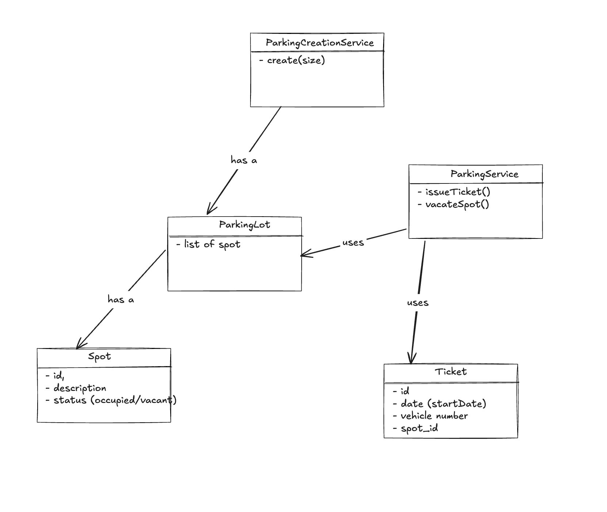
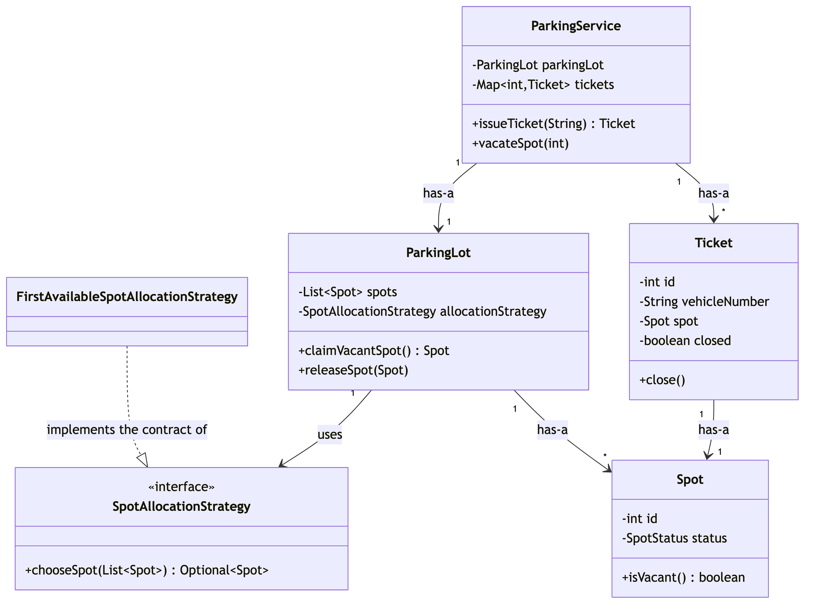
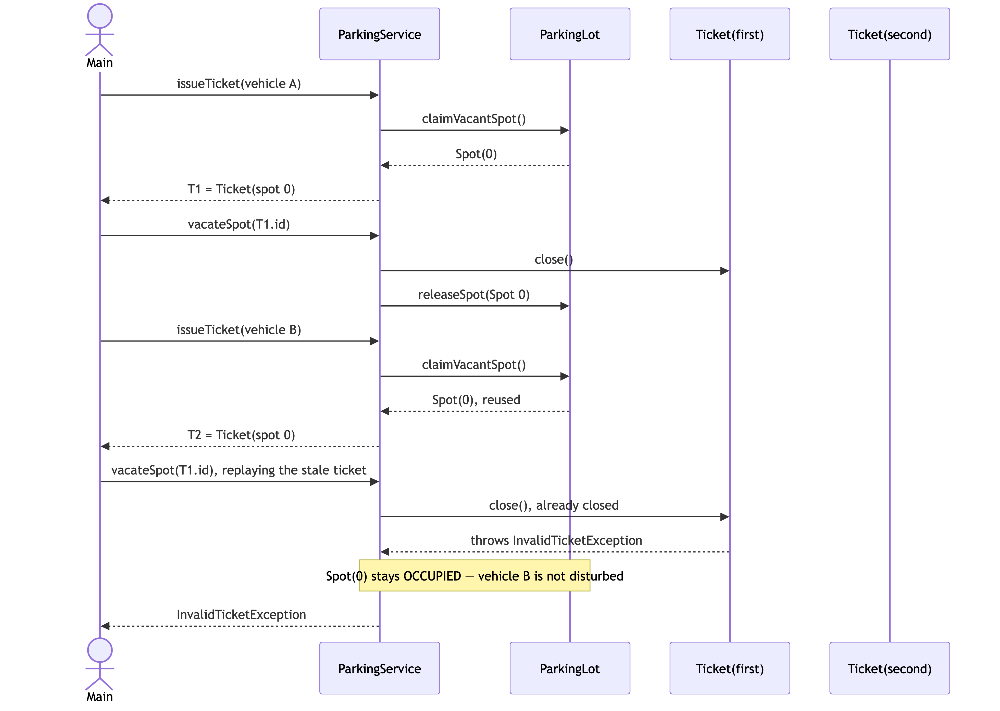

# Session 02 — Parking Lot (LLD/OOD) · 4.4/10

> The happy path *and* the "parking is full" edge case both run correctly — a real step up from Session 01, which
> crashed outright. Exception types are named well (three distinct custom exceptions, not one generic catch-all).
> But pattern selection was skipped again, and a quieter, more dangerous class of bug slipped through: a vacated
> ticket is never invalidated, so replaying it can silently free a spot out from under whoever is parked there now
> — no crash, no error, just wrong state. That's this session's version of Session 01's walkthrough gap.

**Problem:** Design a Parking Lot · **Focus:** class design, no architecture/scale concerns · **Overall:** 4.4/10 ·
**Weakest areas:** Pattern Choice, Correctness/Walkthrough · **Artifacts:**
[`Main.java`](../src/main/java/com/shubham/app/parkinglot/practice/Main.java),
[entity/](../src/main/java/com/shubham/app/parkinglot/practice/entity/),
[service/](../src/main/java/com/shubham/app/parkinglot/practice/service/),
[exception/](../src/main/java/com/shubham/app/parkinglot/practice/exception/),
[class-diagram.png](../src/main/java/com/shubham/app/parkinglot/practice/diagram/class-diagram.png)

## The problem

> - Admin should be able to add the layout of his parking lot with exact open spots
> - User should be able to get a ticket to the empty parking spot
> - User should be able to vacate that spot anytime
> - No ticket to be issued in case all parking spots are occupied

What it really tests: whether a ticket is treated as a **single-use claim** on a spot — invalidated the instant
it's redeemed — or as a reusable reference that can be replayed against a spot that's since been reassigned to
someone else; and whether "find a vacant spot, then claim it" is treated as one atomic step or two.

## Requirements & entities gathered

What was produced: 4 clear, verb-based functional requirements, one explicit out-of-scope item ("Reservation of
Spot" — already ahead of Session 01, which named zero), and an entity list (`Spot`, `ParkingLot`, `Ticket`,
`ParkingService`, `InvalidSpotError`).

Gaps against [step ① and ②](../concepts/answer-framework.md#-requirements--scope) of the framework: no actor named
explicitly — "Admin" and "User" only ever appear inside the requirement sentences, never called out as
`Actors: Admin, User` — no one-sentence responsibility per entity, and the entity list mixes an exception type
(`InvalidSpotError`) in with the actual domain entities, a sign step ⑥ wasn't kept separate from step ②. The list
is also stale against the real code: `ParkingLotCreation`, a class that does real work (validates size, builds
every `Spot`), never made it into the written list at all.

## The design produced



- `ParkingLot` — has-a `List<Spot>`.
- `ParkingService` — the diagram labels its edges to `ParkingLot` and `Ticket` as **uses**, but in the actual code
  both are fields held for the object's entire lifetime (constructor-injected, stored, read on every call) — that's
  **has-a**, not a transient "uses." Worth catching yourself on: "uses" is for a collaborator you don't own the
  lifecycle of (like `GamePlayService`'s `Dice` in Session 01's ideal design), not for a field you hold forever.
- `ParkingLotCreation` — the diagram draws a "has a" edge to `ParkingLot`, but the code never actually holds a
  `ParkingLot` field; `createParking(size)` just builds one and returns it. That edge is really "creates," a
  factory-shaped relationship, not ownership.

Real credit here that Session 01 didn't earn: relationship *types* were attempted at all (labeled edges, not bare
arrows). The labels just don't all match what the code actually does — a useful habit is to re-check each edge
against the field declarations after drawing it, not just against the class names.

## Scorecard

| Axis | Score /10 | Note |
|---|---|---|
| Requirements & Entities | 5/10 | Clear FRs + a real out-of-scope line; missing actor names, per-entity responsibility sentences, and drifted from the actual code (`ParkingLotCreation` missing from the list) |
| Class Diagram & Relationships | 6/10 | Relationship types attempted (ahead of Session 01); two of three labeled edges don't match what the code does (uses vs. has-a, has-a vs. creates) |
| Pattern Choice & Justification | 2/10 | No pattern chosen anywhere, despite an obvious hook: spot-allocation policy (currently "first vacant spot found") is exactly a Strategy candidate |
| Implementation & Exception Handling | 5/10 | Three well-named custom exceptions (a real strength), but a constructor bypasses its own field's validation, a static counter is reset per instance, and every entity exposes unchecked setters |
| Correctness (Primary-Flow Walkthrough) | 4/10 | The demo runs clean and even exercises the "parking full" case without crashing — ahead of Session 01 — but a 2-ticket trace on the same spot (issue → vacate → reissue → vacate again) would have caught a silent state-corruption bug |
| **Overall** | **4.4/10** | Real progress over Session 01 (no crash, better exceptions, relationship types attempted) — same two weakest axes though |

## What lost points — and the fix

| What I missed | The senior answer | Study link |
|---|---|---|
| `Spot(int id)`'s single-arg constructor sets the field directly (`Spot.java:10-12`), bypassing the `id < 0` check that only lives in `setId(...)` — that validation is dead code on the actual construction path used everywhere in this codebase | Validate in the constructor itself, not only in a setter nothing calls; a setter-only check protects nothing if every real caller uses the constructor | [`concepts/answer-framework.md`](../concepts/answer-framework.md#-exception-handling) §⑥ |
| `vacateSpot(ticketId)` never invalidates the ticket after use (`ParkingService.java:52-70`) — calling it twice with the same id silently succeeds both times; if that spot has since been reissued to a new vehicle, the second (stale) call frees the *new* occupant's spot with no error at all | Mark a ticket closed on its first vacate; reject a second vacate on an already-closed ticket with `InvalidTicketException` — this is this session's version of Session 01's crash, just quieter | [`concepts/answer-framework.md`](../concepts/answer-framework.md#-primary-flow-walkthrough) §⑦ |
| `issueTicket` finds a vacant `Spot`, then calls `synchronized void setStatus(...)` as a separate step (`ParkingService.java:31-43`) — two threads can both pick the same vacant spot before either flips it to `OCCUPIED`; locking the setter alone doesn't make the find-then-claim sequence atomic | Guard the whole find-and-claim as one unit — e.g. a single `synchronized` method on `ParkingLot` that finds *and* claims a spot before returning it | [`concepts/answer-framework.md`](../concepts/answer-framework.md#-concurrency--extensibility) §⑧ |
| `private static int ticketId` is reset to `0` inside every `ParkingService` constructor (`ParkingService.java:20,23`) — a second `ParkingService` (a second parking lot) resets the shared counter, so two lots' tickets can collide on id | Make the counter an instance field seeded once, not a `static` field an instance constructor keeps resetting | [`concepts/basic-oop-concepts.md`](../concepts/basic-oop-concepts.md#1-encapsulation) §1 |
| No pattern chosen anywhere, despite spot allocation ("first vacant spot found," `ParkingService.java:32-37`) being exactly the kind of policy step ④ asks you to flag | Put the allocation rule behind an interface (`SpotAllocationStrategy`) — nearest-to-entrance, size-matched-to-vehicle, etc. all become one new class instead of an edit to `issueTicket` | [`concepts/answer-framework.md`](../concepts/answer-framework.md#-pattern-choice--justification) §④ |
| Every entity exposes full public setters with no invariant checks (`ParkingLot.setSpots`, `Ticket.setId/setCreatedAt/setVehicleNumber/setSpot`) | Keep mutation behind intention-revealing methods; nothing outside construction needs to replace a `Ticket`'s vehicle number or a lot's entire spot list | [`concepts/basic-oop-concepts.md`](../concepts/basic-oop-concepts.md#1-encapsulation) §1 |

## What went well

- The full happy path runs end-to-end in `Main.java`: lot creation, ticket issuance, vacate, and — genuinely
  ahead of Session 01 — the "parking full" case is exercised and its exception is caught and printed instead of
  crashing the program.
- Three distinct, well-named custom exceptions (`InvalidSpotException`, `InvalidTicketException`,
  `ParkingFullException`) name the actual failure cases instead of relying on generic exceptions — better
  exception-type coverage than Session 01 had.
- A class diagram was drawn with real relationship *labels* ("has a," "uses") rather than bare arrows — the intent
  to categorize relationships is there this time, even where the specific label doesn't match the code.
- An explicit out-of-scope line ("Reservation of Spot") was written down before designing — Session 01 had none.

---

## The ideal design

> **Implemented** in [`src/main/java/com/shubham/app/parkinglot/ideal/`](../src/main/java/com/shubham/app/parkinglot/ideal)
> — see that package's own [`README.md`](../src/main/java/com/shubham/app/parkinglot/ideal/README.md) for exactly
> what changed vs. this doc and why (mostly: where each fix below actually lives in code).

**Framing sentence:** a `Ticket` is a single-use claim on a `Spot`, not a reusable reference — the moment it's
redeemed it must die, the same way a boarding pass or a movie ticket can't be replayed. Everything below (the
double-vacate fix, the atomic claim, the pattern choice) follows from taking that claim seriously.

The rest of this section follows [`concepts/answer-framework.md`](../concepts/answer-framework.md)'s 8 steps in
order, the same structure Session 01's ideal design and `elevatorsystem/README.md` both use.

### ① Functional Requirements & Scope

**Actors:** Admin (configures the lot's layout), Driver (gets a ticket, vacates a spot).

**Operations:** build a lot with N spots, issue a ticket for a vacant spot, vacate a spot given its ticket, reject
issuance once every spot is occupied.

**Explicitly out of scope:** reservations (already named in the practice attempt), pricing/billing, multiple
floors or zones, and matching a vehicle type to a spot type. None of these were asked for — naming them keeps the
design from growing features nobody requested.

### ② Core Entities & Responsibilities

| Entity | Responsibility |
|---|---|
| `Spot` | id + status; validates its own id at construction; `occupy()`/`vacate()` are package-private so only `ParkingLot` can drive its status. |
| `SpotAllocationStrategy` (interface) | The varying concept: *which* vacant spot to hand out. `FirstAvailableSpotAllocationStrategy` is the one implementation. |
| `ParkingLot` | Owns all `Spot`s and the allocation policy; the *only* place a spot's status ever actually changes, always as one atomic find-and-claim. |
| `Ticket` | A single-use claim on a `Spot`; knows how to close itself exactly once. |
| `ParkingService` | The entry point: issue a ticket (claims a spot), vacate a spot (closes its ticket, releases the spot). |
| `ParkingLotCreationService` | Builds a `ParkingLot` of the requested size — the class the practice attempt's entity list left out. |
| `InvalidSpotException` / `InvalidTicketException` / `ParkingFullException` | Name the three distinct failure cases instead of one generic exception. |

### ③ Relationships & Class Diagram

Named per [`concepts/uml-diagrams.md`](../concepts/uml-diagrams.md#1-class-diagram)'s four categories:

- **Implements the contract of** — `FirstAvailableSpotAllocationStrategy` implements the contract of
  `SpotAllocationStrategy` (realization, dashed arrow).
- **Has-a** — `ParkingLot` has-a `List<Spot>`; `Ticket` has-a `Spot`; `ParkingService` has-a `ParkingLot` and
  has-a the `Map<Integer, Ticket>` of tickets it has issued. All four are fields held for the object's entire
  lifetime — the mislabeling the practice attempt's diagram had (drawing these as "uses") is fixed here.
- **Uses** — `ParkingLot` uses a `SpotAllocationStrategy` (association, not composition): the strategy is a
  swappable collaborator injected from outside, not state `ParkingLot` owns the lifecycle of — the same reason
  `Dice` was an interface in Session 01's ideal design.
- **Is-a** — deliberately absent. There's no genuine inheritance hierarchy anywhere in this design; every
  variation point here is a swappable strategy behind an interface, per the composition-over-inheritance default
  in [`concepts/basic-oop-concepts.md`](../concepts/basic-oop-concepts.md#2-inheritance) §2.

**Ideal class diagram:** source at
[`diagrams/session02-ideal-class-diagram.mmd`](diagrams/session02-ideal-class-diagram.mmd).



### ④ Pattern Choice & Justification

**Pattern used: Strategy Pattern.**

Put the "which spot?" policy behind an interface, so the calling code can swap policies without changing itself.

- **Spot allocation:** `ParkingLot` only knows the `SpotAllocationStrategy` interface. `FirstAvailableSpotAllocationStrategy`
  is the one implementation today; a nearest-to-entrance policy or a size-matched-to-vehicle policy is one new
  class, not an edit to `ParkingLot` or `ParkingService`.

### ⑤ Core Classes/Interfaces

Signatures only — full implementations are in
[`src/main/java/com/shubham/app/parkinglot/ideal/`](../src/main/java/com/shubham/app/parkinglot/ideal), and tests
proving each class's behavior are in
[`src/test/java/com/shubham/app/parkinglot/ideal/`](../src/test/java/com/shubham/app/parkinglot/ideal)
(`SpotTest`, `ParkingLotTest`, `TicketTest`, `ParkingLotCreationServiceTest`, `ParkingServiceTest`):

```java
interface SpotAllocationStrategy { Optional<Spot> chooseSpot(List<Spot> spots); }
class FirstAvailableSpotAllocationStrategy implements SpotAllocationStrategy { }

class Spot {
    Spot(int id);          // validates id >= 0
    boolean isVacant();
}

class ParkingLot {
    ParkingLot(List<Spot> spots, SpotAllocationStrategy allocationStrategy);
    Spot claimVacantSpot();     // atomic find-and-claim
    void releaseSpot(Spot spot);
}

class Ticket {
    Ticket(int id, String vehicleNumber, Spot spot);
    void close();          // throws InvalidTicketException if already closed
}

class ParkingService {
    ParkingService(ParkingLot parkingLot);
    Ticket issueTicket(String vehicleNumber);
    void vacateSpot(int ticketId);
}
```

### ⑥ Exception Handling

- `InvalidSpotException` — thrown by `Spot`'s constructor for a negative id, and by `ParkingLotCreationService`
  for a non-positive lot size.
- `ParkingFullException` — thrown by `ParkingLot.claimVacantSpot()` when no vacant spot exists.
- `InvalidTicketException` — thrown by `ParkingService.vacateSpot` for an unknown ticket id, and by
  `Ticket.close()` when the ticket has already been used once — this is the fix for the practice attempt's
  silent-corruption bug.
- Edge case handled **without** an exception: `Spot.isVacant()` is a plain query, never a check-and-throw — the
  caller decides what a vacant/occupied spot means to it.

### ⑦ Primary-Flow Walkthrough — the actual fix for this session's bug

Source at
[`diagrams/session02-ideal-sequence-diagram.mmd`](diagrams/session02-ideal-sequence-diagram.mmd).



Vehicle A gets a ticket for spot 0, then vacates it. Vehicle B is issued a ticket and reuses spot 0. Replaying
vehicle A's now-stale ticket calls `Ticket.close()` a second time, which throws `InvalidTicketException` instead
of silently freeing vehicle B's spot — see `Main.java`'s demo output and the regression test
`ParkingServiceTest#replayingAnAlreadyVacatedTicketDoesNotFreeTheNextOccupantsSpot`.

### ⑧ Concurrency & Extensibility

**Concurrency:**
- `ParkingLot.claimVacantSpot()` is one `synchronized` method — the find and the claim happen as a single atomic
  step, so two threads can never pick the same vacant spot.
- `Ticket.close()` is `synchronized` — closing the same ticket from two threads at once still only succeeds once.
- A test (`ParkingLotTest#concurrentClaimsNeverDoubleBookTheSameSpot`) fires more concurrent claims than there are
  spots and checks every spot is claimed by exactly one caller, with the rest correctly rejected.

**Extensibility:**
- A new allocation policy → one new `SpotAllocationStrategy` implementation, zero changes to `ParkingLot`.
- A new failure case → one new custom exception, following the same naming convention as the three here.

## Takeaways to drill

1. A validation rule only protects the codebase if it sits on every path that constructs the object — check the
   constructor, not just the setter, especially when (like here) the setter is never actually called by anything.
2. "Find the resource, then claim it" is two steps unless something makes them atomic together — locking the
   second step alone (`setStatus`) does nothing to protect the first step (the scan for a vacant spot).
3. A ticket, receipt, or token that represents a one-time claim should die the moment it's redeemed. If nothing
   marks it "used," walk the flow again with the same ticket to see what happens the second time — that's exactly
   the trace that catches this bug.
4. Static mutable state (`private static int ticketId`) reset inside an *instance* constructor is a contradiction
   waiting to surface the moment a second instance exists — read every `static` field out loud and ask "what
   happens if I construct this twice?"
5. Naming multiple specific exception types (like this session did) is real credit — keep doing it. The next
   step up is making sure each one is actually reachable from every code path that should throw it.

> Rehearse this against [`concepts/answer-framework.md`](../concepts/answer-framework.md) before the next mock. A
> good next practice move: re-attempt this same problem with the fixes above applied, then add a
> `SpotAllocationStrategy` interface — that single change is enough to also close out the Pattern Choice gap.

## How to Improve

The single highest-leverage habit to build next: after any "issue → vacate" style flow, trace it a **second time**
with the *same* handle (ticket, token, id) reused — Session 01's walkthrough gap produced a crash, this session's
produced silent corruption instead, which is easy to miss precisely because nothing visibly breaks.
