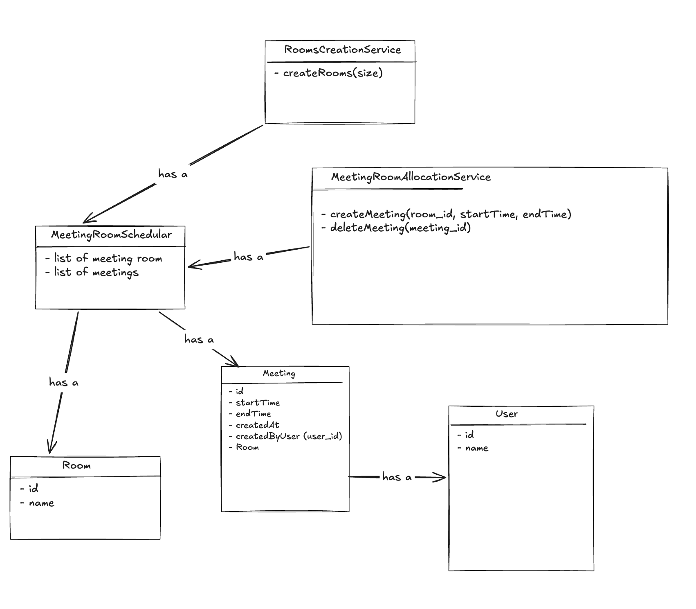
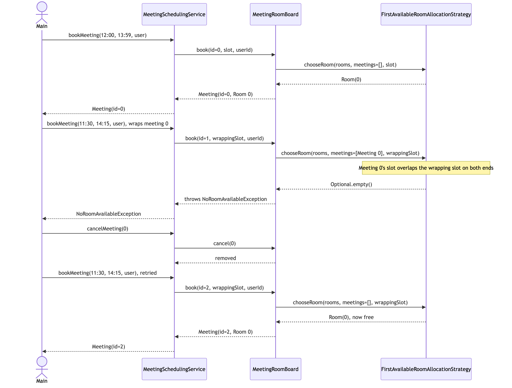

# Session 03 — Meeting Room Scheduler (LLD/OOD) · 3.6/10

> Actors are named explicitly for the first time in this tracker — real progress on step ①. But two real
> correctness bugs slipped through (a double-booking gap and a meeting-id bug that breaks cancellation), the
> booking API doesn't actually satisfy its own stated requirement ("book a **vacant** room" required the caller
> to already know which room), and — the third session running — no pattern was chosen despite an obvious hook.

**Problem:** Design a Meeting Room Scheduler · **Focus:** class design, no architecture/scale concerns ·
**Overall:** 3.6/10 · **Weakest areas:** Pattern Choice, Correctness/Walkthrough · **Artifacts:**
[`Main.java`](../src/main/java/com/shubham/app/meetingscheduler2/Main.java),
[entity/](../src/main/java/com/shubham/app/meetingscheduler2/practice/entity/),
[service/](../src/main/java/com/shubham/app/meetingscheduler2/practice/service/),
[exception/](../src/main/java/com/shubham/app/meetingscheduler2/practice/exception/),
[class-diagram.png](../src/main/java/com/shubham/app/meetingscheduler2/practice/diagram/class-diagram.png)

## The problem

> - Admin should be able to do setup and create n meeting rooms
> - User should be able to book a vacant meeting [room] for a scheduled interval
> - User should be able to cancel a scheduled meeting

What it really tests: whether "book a vacant room" is modeled as the system *finding* a free room for a
requested time interval, or as the caller *telling* the system which room to check — and whether two time
intervals are compared with a check that's actually correct for every ordering of the two ranges, not just the
one ordering a demo happens to try.

## Requirements & entities gathered

What was produced: actors named explicitly (`Admin`, `User` — a first for this tracker, real credit), 3
verb-based functional requirements, one out-of-scope item ("Video conferencing in a meeting room"), and an entity
list (`Room`, `Meeting`, `RoomStatus` enum, `User`, `RoomsCreationsService`, `MeetingRoomAllocationService`).

Gaps against [step ① and ②](../concepts/answer-framework.md#-requirements--scope) of the framework: no
one-sentence responsibility per entity, and the entity list has drifted from the actual code in both directions —
`RoomStatus` (vacant/booked) is listed but was never implemented (availability is inferred by scanning meetings
for time overlap instead), while the doc's `RoomsCreationsService` and `MeetingRoomAllocationService` names don't
match the real class names (`MeetingRoomCreationService`, `MeetingRoomAllocationService` — close, but not
identical, which matters once a reader tries to jump from the doc to the code). The `## Errors` section lists only
one exception (`RoomAlreadyReserved`, which doesn't match the actual class name `RoomAlreadyBookedException`
either) plus a trailing empty bullet, while the code actually defines four distinct exception types.

## The design produced



- `MeetingRoomSchedular` — has-a list of `Room`, has-a list of `Meeting`.
- `MeetingRoomAllocationService` — has-a `MeetingRoomSchedular`.
- `Meeting` — has-a `Room`, and the diagram draws a "has a" edge to `User` too — but the actual `Meeting` class
  only stores a raw `createdByUserId` int, never a `User` reference. That edge documents a relationship the code
  doesn't have.
- `Room`'s diagram box lists `id, name` fields, but the actual `Room` class has only `id` — no `name` field
  exists in code.

Real credit here: every edge is labeled (`has a`), continuing the improvement Session 02 started. The gap this
time is different — it's not about which relationship type is correct, it's that two of the five drawn
relationships (`Meeting → User`, `Room`'s `name` field) describe a design that was never actually built.

## Scorecard

| Axis | Score /10 | Note |
|---|---|---|
| Requirements & Entities | 6/10 | Actors named explicitly for the first time — real progress; but the entity list drifted from the code in both directions (an undone `RoomStatus`, and class-name mismatches) and the Errors section is incomplete |
| Class Diagram & Relationships | 5/10 | Every edge labeled `has-a` (continuing Session 02's improvement); two edges describe fields that don't exist in the actual code (`Meeting → User`, `Room.name`) |
| Pattern Choice & Justification | 1/10 | No pattern chosen — and worse than prior sessions, because the missing Strategy also means the system doesn't satisfy its own requirement (the caller must already pick a room instead of the system finding a vacant one) |
| Implementation & Exception Handling | 4/10 | Four well-named custom exceptions (real strength, more than prior sessions) — but a meeting-id counter that's never incremented breaks cancellation, and `MeetingRoomSchedular` exposes every internal collection (and even the raw id counter) via public getters/setters |
| Correctness (Primary-Flow Walkthrough) | 2/10 | The demo runs without crashing, but a real double-booking bug exists (a wrapping interval isn't detected as a conflict) and the entire cancel flow — a stated functional requirement — was never exercised in `Main.java` at all, and it's broken |
| **Overall** | **3.6/10** | The lowest score logged so far — driven by an unmet functional requirement, a broken cancel feature, and a correctness bug, despite real gains in actor-naming and exception coverage |

## What lost points — and the fix

| What I missed | The senior answer | Study link |
|---|---|---|
| `createMeeting` requires the caller to already pass a `roomId` (`MeetingRoomAllocationService.java:23`) — but the stated requirement is "book a **vacant** meeting room," which implies the system finds one, not the caller | Put "which room?" behind a `RoomAllocationStrategy` interface — the system searches for any free room for the requested interval, the same shape as the parking lot's `SpotAllocationStrategy` and the elevator's `DispatchStrategy` | [`concepts/answer-framework.md`](../concepts/answer-framework.md#-pattern-choice--justification) §④ |
| The overlap check (`MeetingRoomAllocationService.java:38-47`) only tests whether the *new* meeting's start or end falls inside an *existing* meeting — it never catches the reverse: a new interval that fully **wraps** an existing one (e.g. booking `11:30–14:15` around an existing `12:00–13:59` meeting) slips through undetected | Use the standard half-open interval test: two slots overlap iff `a.start < b.end && b.start < a.end` — this single formula is symmetric and catches every ordering, including full containment either direction | [`concepts/answer-framework.md`](../concepts/answer-framework.md#-primary-flow-walkthrough) §⑦ |
| `int meetingId = meetingRoomSchedular.getAtomicInteger().get()` (`MeetingRoomAllocationService.java:50`) reads the counter but never calls `getAndIncrement()` — every single meeting is created with id `0`, so `deleteMeeting(meetingId)` can only ever remove the first meeting in the list, regardless of which id is actually passed | Advance the counter on every booking (`getAndIncrement()`, or better, own it as a private instance field instead of exposing the raw `AtomicInteger` at all) | [`concepts/basic-oop-concepts.md`](../concepts/basic-oop-concepts.md#1-encapsulation) §1 |
| `MeetingRoomSchedular` exposes `getRooms`/`setRooms`, `getScheduledMeetings`/`setScheduledMeetings`, and even `getAtomicInteger`/`setAtomicInteger` (`MeetingRoomSchedular.java:20-42`) — any caller can mutate the room list, the meeting list, or reset the id counter directly, completely bypassing `MeetingRoomAllocationService`'s conflict checking | Hide the collections entirely; expose only intention-revealing methods (`book(...)`, `cancel(...)`) that keep the find-and-reserve sequence atomic and never hand out a live mutable reference | [`concepts/basic-oop-concepts.md`](../concepts/basic-oop-concepts.md#1-encapsulation) §1 |
| `Main.java` never calls `deleteMeeting` at all — an entire stated functional requirement (cancel a meeting) shipped with zero walkthrough, and it happens to be broken (see the meeting-id bug above) | Walk every functional requirement's flow at least once, not just the ones that happen to be convenient to demo — an untested flow is exactly where a real bug hides | [`concepts/answer-framework.md`](../concepts/answer-framework.md#-primary-flow-walkthrough) §⑦ |

## What went well

- Actors are named explicitly (`Admin`, `User`) for the first time in this tracker — a genuinely new habit worth
  keeping, not something the first two sessions did.
- Four distinct, well-named custom exceptions (`InvalidMeetingException`, `InvalidMeetingRoom`,
  `InvalidNumberOfRoomsException`, `RoomAlreadyBookedException`) — more exception-type coverage than either prior
  session.
- Concurrency was handled correctly where it mattered: `createMeeting` and `deleteMeeting` are each one
  `synchronized` method wrapping the whole check-then-mutate sequence, avoiding the exact
  find-then-claim race Session 02's practice attempt had.
- The class diagram labels every edge (`has a`), continuing the habit Session 02 started, instead of reverting to
  Session 01's bare arrows.

---

## The ideal design

> **Implemented** in [`src/main/java/com/shubham/app/meetingscheduler2/ideal/`](../src/main/java/com/shubham/app/meetingscheduler2/ideal)
> — see that package's own [`README.md`](../src/main/java/com/shubham/app/meetingscheduler2/ideal/README.md) for
> exactly what changed vs. this doc and why.

**Framing sentence:** booking a meeting room is really "reserve any free resource for a requested time interval
without corrupting another reservation" — the room a caller gets is an implementation detail the system decides,
and the interval-overlap check is the one piece of logic that must be correct for *every* possible relative
ordering of two ranges, not just the ordering a demo happens to try.

The rest of this section follows [`concepts/answer-framework.md`](../concepts/answer-framework.md)'s 8 steps in
order, the same structure Sessions 01 and 02's ideal designs use.

### ① Functional Requirements & Scope

**Actors:** Admin (configures the room layout), User (books and cancels meetings).

**Operations:** create N meeting rooms, book a vacant room for a requested time interval (the system picks the
room), cancel a booked meeting by id.

**Explicitly out of scope:** video conferencing (kept from the practice attempt), recurring meetings, room
capacity/attendee limits, and letting the caller request a *specific* room — none of these were asked for.

### ② Core Entities & Responsibilities

| Entity | Responsibility |
|---|---|
| `Room` | Just an id — a room has no behavior of its own in this design. |
| `TimeSlot` | The varying-nothing-but-critical value: a start/end pair that validates itself (`start < end`) and knows how to test overlap against another slot. |
| `RoomAllocationStrategy` (interface) | The varying concept: *which* free room to hand out for a requested slot. `FirstAvailableRoomAllocationStrategy` is the one implementation. |
| `MeetingRoomBoard` | Owns all `Room`s and `Meeting`s; the *only* place a booking is ever recorded or removed, always as one atomic step. |
| `Meeting` | id, `TimeSlot`, `Room`, and the id of the user who booked it. |
| `User` | id, name — passed in, never stored by anything except a `Meeting`'s raw id. |
| `MeetingSchedulingService` | The entry point: book a meeting (delegates room-picking to the board), cancel a meeting. |
| `MeetingRoomCreationService` | Builds a `MeetingRoomBoard` of the requested size. |
| `InvalidNumberOfRoomsException` / `InvalidTimeSlotException` / `NoRoomAvailableException` / `InvalidMeetingException` | Name the four distinct failure cases. |

### ③ Relationships & Class Diagram

Named per [`concepts/uml-diagrams.md`](../concepts/uml-diagrams.md#1-class-diagram)'s four categories:

- **Implements the contract of** — `FirstAvailableRoomAllocationStrategy` implements the contract of
  `RoomAllocationStrategy` (realization, dashed arrow).
- **Has-a** — `MeetingRoomBoard` has-a `List<Room>` and has-a `List<Meeting>`; `Meeting` has-a `Room` and has-a
  `TimeSlot`; `MeetingSchedulingService` has-a `MeetingRoomBoard`. All fields held for the object's entire
  lifetime — unlike the practice attempt's diagram, no edge here points at a field the code doesn't actually have.
- **Uses** — `MeetingRoomBoard` uses a `RoomAllocationStrategy` (a swappable collaborator, not owned state);
  `MeetingSchedulingService` uses a `User` (a parameter passed in per call, never stored as a field).
- **Is-a** — deliberately absent; every variation point is a swappable strategy behind an interface, per the
  composition-over-inheritance default in
  [`concepts/basic-oop-concepts.md`](../concepts/basic-oop-concepts.md#2-inheritance) §2.

**Ideal class diagram:** source at
[`diagrams/session03-ideal-class-diagram.mmd`](diagrams/session03-ideal-class-diagram.mmd).


### ④ Pattern Choice & Justification

**Pattern used: Strategy Pattern.**

Put the "which room?" policy behind an interface, so the calling code can swap policies without changing itself —
the same pattern this repo has now used three times running (`DispatchStrategy` for the elevator,
`SpotAllocationStrategy` for the parking lot, `RoomAllocationStrategy` here).

- **Room allocation:** `MeetingRoomBoard` only knows the `RoomAllocationStrategy` interface.
  `FirstAvailableRoomAllocationStrategy` is the one implementation today; a "smallest room that's still free" or
  "closest to a preferred floor" policy is one new class, not an edit to `MeetingRoomBoard` or
  `MeetingSchedulingService`.

### ⑤ Core Classes/Interfaces

Signatures only — full implementations are in
[`src/main/java/com/shubham/app/meetingscheduler2/ideal/`](../src/main/java/com/shubham/app/meetingscheduler2/ideal),
and tests proving each class's behavior are in
[`src/test/java/com/shubham/app/meetingscheduler2/ideal/`](../src/test/java/com/shubham/app/meetingscheduler2/ideal)
(`TimeSlotTest`, `MeetingRoomBoardTest`, `FirstAvailableRoomAllocationStrategyTest`,
`MeetingRoomCreationServiceTest`, `MeetingSchedulingServiceTest`):

```java
class TimeSlot {
    TimeSlot(Instant start, Instant end);   // requires start < end
    boolean overlaps(TimeSlot other);
}

interface RoomAllocationStrategy { Optional<Room> chooseRoom(List<Room> rooms, List<Meeting> existingMeetings, TimeSlot requested); }
class FirstAvailableRoomAllocationStrategy implements RoomAllocationStrategy { }

class MeetingRoomBoard {
    MeetingRoomBoard(List<Room> rooms, RoomAllocationStrategy allocationStrategy);
    Meeting book(int meetingId, TimeSlot requested, int bookedByUserId);   // atomic find-and-reserve
    void cancel(int meetingId);
}

class MeetingSchedulingService {
    MeetingSchedulingService(MeetingRoomBoard board);
    Meeting bookMeeting(Instant start, Instant end, User user);
    void cancelMeeting(int meetingId);
}
```

### ⑥ Exception Handling

- `InvalidNumberOfRoomsException` — thrown by `MeetingRoomCreationService` for a non-positive room count.
- `InvalidTimeSlotException` — thrown by `TimeSlot`'s constructor when `start` isn't before `end`.
- `NoRoomAvailableException` — thrown by `MeetingRoomBoard.book(...)` when every room conflicts with the
  requested slot.
- `InvalidMeetingException` — thrown by `MeetingRoomBoard.cancel(...)` for an unknown meeting id.
- Edge case handled **without** an exception: re-booking the exact same slot right after cancelling it is a
  plain, allowed booking — nothing special-cases it.

### ⑦ Primary-Flow Walkthrough — the actual fix for this session's bug

Source at
[`diagrams/session03-ideal-sequence-diagram.mmd`](diagrams/session03-ideal-sequence-diagram.mmd).



A meeting is booked for `12:00–13:59`. A second request for `11:30–14:15` — a slot that fully wraps the first —
is correctly rejected with `NoRoomAvailableException`, because `TimeSlot.overlaps(...)` uses the symmetric
interval test instead of only checking whether an endpoint falls inside the other slot. Cancelling the first
meeting and retrying the wrapping request then succeeds. See `Main.java`'s demo and the regression tests
`FirstAvailableRoomAllocationStrategyTest#aRoomIsNotAvailableWhenTheRequestedSlotWrapsAnExistingMeeting` and
`MeetingSchedulingServiceTest#bookingASlotThatWrapsAnExistingMeetingIsRejected`. The meeting-id bug is fixed
alongside it — `MeetingSchedulingServiceTest#eachBookedMeetingGetsADistinctId` and
`#cancellingOneMeetingDoesNotAffectAnother` are its regression tests.

### ⑧ Concurrency & Extensibility

**Concurrency:**
- `MeetingRoomBoard.book(...)` and `.cancel(...)` are each one `synchronized` method — finding a free room and
  recording the booking happen as a single atomic step, continuing the same fix already made once for
  `ParkingLot.claimVacantSpot()`.
- A test (`MeetingRoomBoardTest#concurrentBookingsForTheSameSlotNeverDoubleBookARoom`) fires more concurrent
  booking attempts than there are rooms and checks every room is booked by exactly one caller, with the rest
  correctly rejected.

**Extensibility:**
- A new allocation policy → one new `RoomAllocationStrategy` implementation, zero changes to `MeetingRoomBoard`.
- A new failure case → one new custom exception, following the same naming convention as the four here.

## Takeaways to drill

1. When a functional requirement says "book a *vacant* X," check whether your API actually asks the caller to
   name the X first — if it does, the system isn't doing the one thing the requirement asked for.
2. An interval-overlap check has exactly one correct form (`a.start < b.end && b.start < a.end`) — if a check
   needs multiple `||`-joined conditions to express "these two ranges overlap," it's very likely missing a case;
   derive the single symmetric formula instead of enumerating orderings by hand.
3. Read every `AtomicInteger`/counter field out loud and ask "where does this actually advance?" — a counter
   that's only ever `.get()` and never `.incrementAndGet()`/`.getAndIncrement()` is a bug waiting to be found the
   moment two of anything exist.
4. Exposing a raw mutable collection *or* a raw counter object via a getter is the same mistake as exposing a
   setter with no validation — it just takes one more hop to find. If a class owns invariants, it can't hand out
   direct access to the state those invariants protect.
5. Walk every stated functional requirement's flow at least once in the demo — not just the ones that are
   convenient to wire up. The requirement nobody demoed is exactly where this session's worst bug was hiding.

> Rehearse this against [`concepts/answer-framework.md`](../concepts/answer-framework.md) before the next mock. A
> good next practice move: re-attempt this same problem with the fixes above applied, paying specific attention to
> deriving the interval-overlap formula from first principles rather than pattern-matching the demo's happy path.

## How to Improve

The single highest-leverage habit to build next: before coding a conflict/overlap check, write out **all four**
relative orderings of two ranges on paper (disjoint-before, disjoint-after, one nested inside the other in each
direction) and verify the check by hand against all four — not just the one ordering the demo will exercise. This
session's worst bug is exactly the ordering nobody wrote down.
