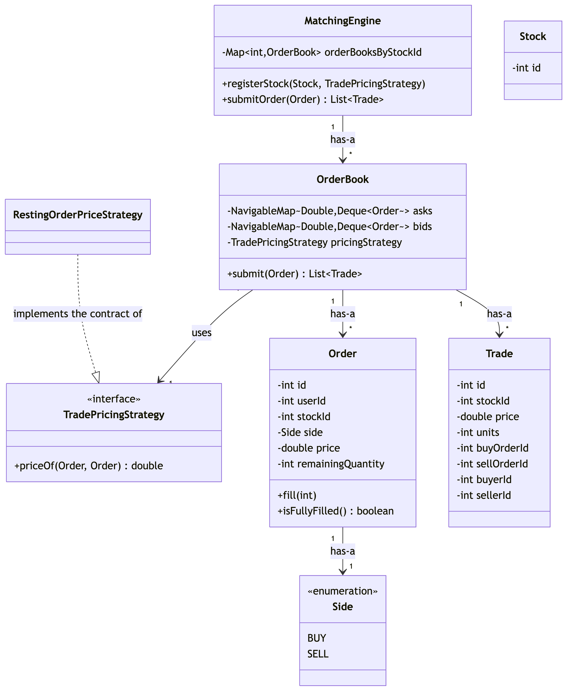
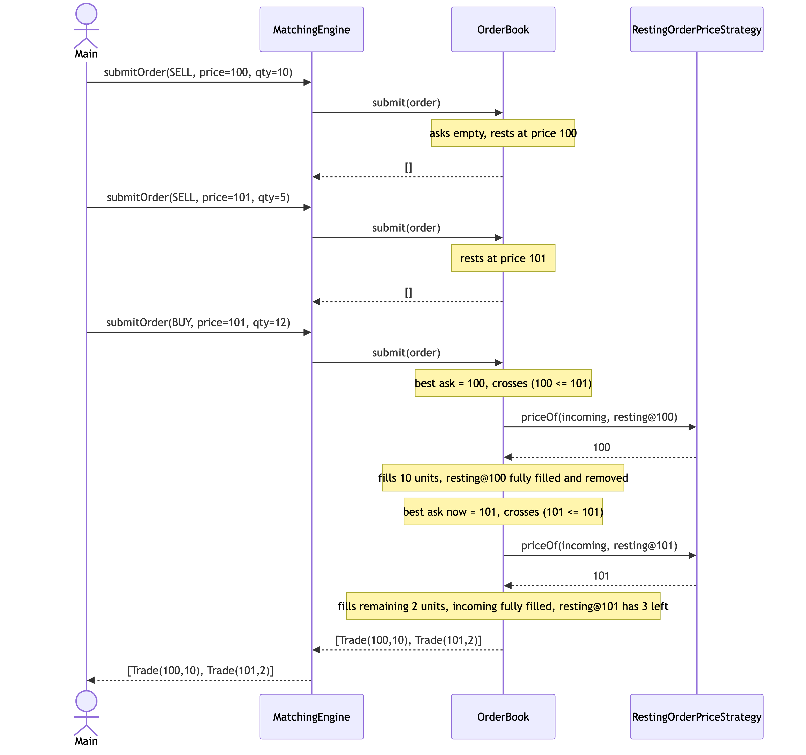

# Session 04 — Stock Trading & Matching (LLD/OOD) · 1.8/10

> The lowest score logged so far, and the first session with nothing runnable at all: no `Main.java`, no diagram,
> an empty Exceptions section, and — the actual core of the problem — a matching method that fetches the order
> book and does nothing with it. The one real strength is a genuinely good data-structure instinct for the order
> book itself (a heap of price levels over a FIFO queue per level), which the ideal design keeps and simplifies.

**Problem:** Design a Stock Trading & Matching engine · **Focus:** class design, no architecture/scale concerns ·
**Overall:** 1.8/10 · **Weakest areas:** Correctness/Walkthrough, Implementation & Exceptions, Pattern Choice ·
**Artifacts:**
[entity/](../src/main/java/com/shubham/app/stocktrading/practice/entity/),
[Exception/](../src/main/java/com/shubham/app/stocktrading/practice/Exception/)
(no `Main.java`, no class diagram, and no tests exist for this session — a first for this tracker)

## The problem

> - User should be able to create a sell order with an ask price
> - User should be able to create a buy order with a bid price
> - User should get the best available price based on price-time order

What it really tests: whether "best available price based on price-time order" actually gets implemented as a
matching algorithm — walking price levels best-first and orders within a level oldest-first — rather than being
left as a one-line method stub, and whether the order book's own bookkeeping (a sorted structure of price levels)
stays internally consistent as orders fill and price levels empty out.

## Requirements & entities gathered

What was produced: actors named explicitly (`Buyer`, `Seller` — continuing Session 03's good habit), 3 verb-based
functional requirements, two out-of-scope items ("Payment / reserve balance," "cancel an order"), and an entity
list (`Stock`, `User`, `Order`, `Trade`, `MatchingEngine`, `MatchingEngineBoardCreation`).

Gaps against [step ① and ②](../concepts/answer-framework.md#-requirements--scope) of the framework: no
one-sentence responsibility per entity; `MatchingEngineBoardCreation` is listed but was never implemented as a
class anywhere in the code, while `OrderBook` — a real, substantial class that *does* exist in code — is missing
from the list entirely. The `## Exceptions` heading has no content under it at all (not even one bullet), even
though the code defines one exception type.

## The design produced

No class diagram exists for this session — a first for this tracker. Every prior session drew at least a
hand-sketched diagram before coding; this one has no visual artifact to review at all, so there's nothing to
check relationship types or drawn-vs-actual drift against.

From reading the code directly: `MatchingEngine` has-a `Map<Integer, OrderBook>` (one book per stock);
`OrderBook` has-a sell-side `Map<Double, List<Order>>` plus a separate `PriorityQueue<Double>` of sell prices, and
the mirror pair for the buy side. That's a real, above-average data-structure choice for an order book — a price
priority queue over a per-price FIFO list is exactly the right shape — but it's never been drawn, so it was never
checked against a reader, and the two parallel structures (the map and the heap) have no code path that keeps
them in sync once a price level empties out (see the Scorecard and lost-points table below).

## Scorecard

| Axis | Score /10 | Note |
|---|---|---|
| Requirements & Entities | 5/10 | Actors and out-of-scope items named (continuing Session 03's improvement); a named-but-unbuilt class, a real class missing from the list, and a completely empty Exceptions section |
| Class Diagram & Relationships | 1/10 | No diagram exists at all — nothing to score for relationship types or drawn-vs-actual drift, a first for this tracker |
| Pattern Choice & Justification | 1/10 | No pattern chosen — a fourth session running — and `OrderBook.addOrder`/`removeOrder` each duplicate a near-identical BUY/SELL branch, the same "flag the varying concept" miss as Session 01's Snake/Ladder duplication |
| Implementation & Exception Handling | 1/10 | The core matching method is an empty stub; `addOrder`/`removeOrder` are `private` with no public caller anywhere, making the entire "create an order" requirement unreachable; one exception exists but is misnamed (`InvalidIOrderException`) and lives in a capitalized `Exception` package, breaking Java convention |
| Correctness (Primary-Flow Walkthrough) | 1/10 | No `Main.java`, no test, nothing to run — there is no primary flow to walk because there is no way to execute this code end-to-end at all |
| **Overall** | **1.8/10** | The lowest score logged so far — every axis but Requirements is at or near the floor, driven by code that cannot be exercised rather than code that runs and has bugs |

## What lost points — and the fix

| What I missed | The senior answer | Study link |
|---|---|---|
| `MatchingEngine.match(int stockId)` (`MatchingEngine.java:9-13`) fetches the `OrderBook` for a stock and does nothing else — the entire matching requirement, the literal point of the problem, is an empty method body | Write the matching loop: walk the opposite side's best price level, fill against it FIFO, move to the next price level while the incoming order still has quantity and the next level still crosses, then rest any remainder | [`concepts/answer-framework.md`](../concepts/answer-framework.md#-primary-flow-walkthrough) §⑦ |
| `OrderBook.addOrder`/`removeOrder` (`OrderBook.java:32-80`) are `private`, and nothing in the given files calls them — there is no public method anywhere that lets a caller actually place an order, so the "create a buy/sell order" requirement has zero reachable code | Make the entry point public, and make it do real work: matching *and* resting are one operation from the caller's point of view (`submit(order)`), not two separately-invoked steps | [`concepts/answer-framework.md`](../concepts/answer-framework.md#-core-classesinterfaces) §⑤ |
| `Order` (`Order.java`) has a full set of public setters and no constructor at all — every field, including `price` and `units`, can be left at its default (`0`) or set to a negative value with zero validation | Validate in a constructor (`price > 0`, `quantity > 0`) the same way `Spot`, `TimeSlot`, and `Board` already do in this repo's other ideal designs — a no-arg constructor plus setters is exactly the anti-pattern those designs moved away from | [`concepts/basic-oop-concepts.md`](../concepts/basic-oop-concepts.md#1-encapsulation) §1 |
| `Trade` (`Trade.java`) documents `sellerId`/`buyerId` fields in its own javadoc, but `Order` has no field recording who placed it — there is no data in the entire design that could ever populate those two fields from a real order | Add the placing user's id to `Order` at construction; a `Trade`'s fields should always be derivable from the two `Order`s that produced it | [`concepts/answer-framework.md`](../concepts/answer-framework.md#-requirements--scope) §① |
| `sellOrderBook`/`sellOrders` (the map and the price heap, `OrderBook.java:13-23`) are two separate structures that must be kept in sync by hand — emptying a price bucket in the map (once every order at that price is removed) never removes that price from the heap, so a stale price can resurface from the heap after its bucket is gone | Use one `NavigableMap<Double, Deque<Order>>` instead of a map plus a separately-maintained heap — sorted-by-price access falls out of the map itself, with nothing to desynchronize | [`concepts/design-principles.md`](../concepts/design-principles.md#kiss--keep-it-simple) — KISS |

## What went well

- The core data-structure choice for the order book is genuinely good: a price-ordered structure (a heap of
  prices) layered over a per-price FIFO list of orders is exactly the textbook shape for price-time priority —
  better structural instinct than any prior session's starting point for its central data structure.
- Actors and out-of-scope items are both named explicitly, continuing the habit Session 03 started.
- The buy-side heap correctly uses a reversed comparator (`(a, b) -> Double.compare(b, a)`) to get a max-heap for
  bids while the sell-side heap stays a natural min-heap for asks — the asymmetry between the two sides of a book
  was understood correctly, even though it was never wired into a working matching loop.

---

## The ideal design

> **Implemented** in [`src/main/java/com/shubham/app/stocktrading/ideal/`](../src/main/java/com/shubham/app/stocktrading/ideal)
> — see that package's own [`README.md`](../src/main/java/com/shubham/app/stocktrading/ideal/README.md) for
> exactly what changed vs. this doc and why.

**Framing sentence:** an order book is a priority queue of price levels, each of which is itself a FIFO queue of
orders — "best available price based on price-time order" is just "pop the best price level, drain it
oldest-order-first, move to the next level," and everything else (the `Side` asymmetry, the Strategy for trade
pricing) is a detail on top of that one structure.

The rest of this section follows [`concepts/answer-framework.md`](../concepts/answer-framework.md)'s 8 steps in
order, the same structure Sessions 01–03's ideal designs use.

### ① Functional Requirements & Scope

**Actors:** Buyer, Seller (kept from the practice attempt).

**Operations:** submit a buy order at a bid price, submit a sell order at an ask price — both go through the same
entry point, since matching and resting are the same operation from the caller's side — and register a stock so
it has an order book to trade against.

**Explicitly out of scope:** payment/balance reservation and order cancellation (both kept from the practice
attempt), plus multiple order types (market orders, stop orders) and cross-stock matching.

### ② Core Entities & Responsibilities

| Entity | Responsibility |
|---|---|
| `Side` (enum) | `BUY` or `SELL` — which side of a stock's book an order sits on. |
| `Order` | id, placing user's id, stock, side, price, and remaining quantity; validates itself at construction and knows how to reduce its own remaining quantity as it's filled. |
| `TradePricingStrategy` (interface) | The varying concept: which price a trade executes at when a buy and a sell cross. `RestingOrderPriceStrategy` is the one implementation. |
| `OrderBook` | Owns one stock's bid side and ask side; the *only* place an order is ever matched or rested, always as one atomic step. |
| `Trade` | A record of one match: stock, price, units, and the two orders (and their owning users) that produced it. |
| `MatchingEngine` | Routes a submitted order to the right stock's `OrderBook`. |
| `InvalidOrderException` / `NoSuchStockException` | Name the two distinct failure cases. |

### ③ Relationships & Class Diagram

Named per [`concepts/uml-diagrams.md`](../concepts/uml-diagrams.md#1-class-diagram)'s four categories:

- **Implements the contract of** — `RestingOrderPriceStrategy` implements the contract of `TradePricingStrategy`
  (realization, dashed arrow).
- **Has-a** — `OrderBook` has-a bid-side and ask-side price structure (each holding `Order`s) and has-a the
  `Trade`s it produces; `MatchingEngine` has-a a `Map` of `OrderBook`s, one per registered stock.
- **Uses** — `OrderBook` uses a `TradePricingStrategy` (a swappable collaborator, not owned state).
- **Is-a** — deliberately absent; the one variation point (trade pricing) is a swappable strategy behind an
  interface, per the composition-over-inheritance default in
  [`concepts/basic-oop-concepts.md`](../concepts/basic-oop-concepts.md#2-inheritance) §2.

**Ideal class diagram:** source at
[`diagrams/session04-ideal-class-diagram.mmd`](diagrams/session04-ideal-class-diagram.mmd).



### ④ Pattern Choice & Justification

**Pattern used: Strategy Pattern.**

Put "which price does a trade execute at?" behind an interface, so the calling code can swap the convention
without changing the matching loop itself — the fourth time this repo has used Strategy for the one policy each
problem asks you to name (`DispatchStrategy`, `SpotAllocationStrategy`, `RoomAllocationStrategy`, and now
`TradePricingStrategy`).

- **Trade pricing:** `OrderBook` only knows the `TradePricingStrategy` interface. `RestingOrderPriceStrategy` —
  trade at whichever order was already resting in the book — is the one implementation, matching this problem's
  own wording ("best available price"). A different convention (aggressor's price, midpoint) is one new class.

### ⑤ Core Classes/Interfaces

Signatures only — full implementations are in
[`src/main/java/com/shubham/app/stocktrading/ideal/`](../src/main/java/com/shubham/app/stocktrading/ideal), and
tests proving each class's behavior are in
[`src/test/java/com/shubham/app/stocktrading/ideal/`](../src/test/java/com/shubham/app/stocktrading/ideal)
(`OrderTest`, `OrderBookTest`, `RestingOrderPriceStrategyTest`, `MatchingEngineTest`):

```java
enum Side { BUY, SELL }

class Order {
    Order(int id, int userId, int stockId, Side side, double price, int quantity);   // requires price, quantity > 0
    void fill(int units);
    boolean isFullyFilled();
}

interface TradePricingStrategy { double priceOf(Order incoming, Order resting); }
class RestingOrderPriceStrategy implements TradePricingStrategy { }

class OrderBook {
    OrderBook(int stockId, TradePricingStrategy pricingStrategy);
    List<Trade> submit(Order incoming);   // atomic match-then-rest
}

class MatchingEngine {
    void registerStock(Stock stock, TradePricingStrategy pricingStrategy);
    List<Trade> submitOrder(Order order);
}
```

### ⑥ Exception Handling

- `InvalidOrderException` — thrown by `Order`'s constructor for a non-positive price or quantity, and by
  `Order.fill(...)` if asked to fill more than what remains.
- `NoSuchStockException` — thrown by `MatchingEngine.submitOrder(...)` for a stock that was never registered.
- Edge case handled **without** an exception: an incoming order that doesn't cross any resting price just rests
  in the book — that's the normal case, not an error.

### ⑦ Primary-Flow Walkthrough — the actual fix for this session's bug

Source at
[`diagrams/session04-ideal-sequence-diagram.mmd`](diagrams/session04-ideal-sequence-diagram.mmd).



Two sell orders rest at `100.0` (10 units) and `101.0` (5 units). A buy order for 12 units at `101.0` crosses the
book: it fully fills the cheaper resting order first (price priority), producing a trade at `100.0` for 10 units,
then fills its remaining 2 units against the next price level, producing a second trade at `101.0` — leaving 3
units still resting there. This is the practice attempt's entire unimplemented core requirement, made real. See
`Main.java`'s demo and the regression test
`OrderBookTest#aCrossingOrderConsumesTheBestPriceLevelFirstThenPartiallyFillsTheNextLevel`.

### ⑧ Concurrency & Extensibility

**Concurrency:**
- `OrderBook.submit(...)` is one `synchronized` method — matching and resting happen as a single atomic step, the
  same fix already made for `ParkingLot.claimVacantSpot()` and `MeetingRoomBoard.book(...)`.
- A test (`OrderBookTest#concurrentCrossingOrdersEachMatchExactlyOneUnitWithNoLostOrDuplicatedFills`) fires more
  concurrent crossing orders than there are resting orders and checks the total traded quantity is exactly right,
  with no order matched twice.

**Extensibility:**
- A new trade-pricing convention → one new `TradePricingStrategy` implementation, zero changes to `OrderBook`.
- A new failure case → one new custom exception, following the same naming convention as the two here.

## Takeaways to drill

1. A method that fetches the data it needs and then does nothing with it is a stub, not an implementation — if
   the core requirement isn't written yet, say that out loud rather than leaving an empty method body that looks
   finished.
2. A `private` method with no caller anywhere in the codebase is unreachable — before moving on, check that every
   method implementing a stated requirement actually has a path a real caller can reach.
3. Two data structures that both describe the same set (a map's keys and a heap's contents) will drift apart the
   moment only one of them is updated — prefer one structure that's sorted by construction (`TreeMap`) over
   maintaining two by hand.
4. If a `Trade`/receipt/output record needs a field (`buyerId`), check the input record (`Order`) actually carries
   the data to populate it — a field that can never be filled in from anything upstream is a modeling gap, not an
   implementation detail to fix later.
5. Build and run a demo (`Main.java`) for every session, even an incomplete one — a design with zero runnable code
   can't be walked, scored on correctness, or shown to an interviewer as "here's it working."

> Rehearse this against [`concepts/answer-framework.md`](../concepts/answer-framework.md) before the next mock. A
> good next practice move: re-attempt this same problem and get to a working `Main.java` demo first, even a
> trivial one — everything else in the framework (exceptions, concurrency, pattern choice) is easier to reason
> about once there's a real flow to point at.

## How to Improve

The single highest-leverage habit to build next: treat "does this run?" as the very first check on any session,
before scoring anything else. Every other finding this session — the stub method, the unreachable private
methods, the missing diagram — would have surfaced immediately the moment a `Main.java` was written and run.
