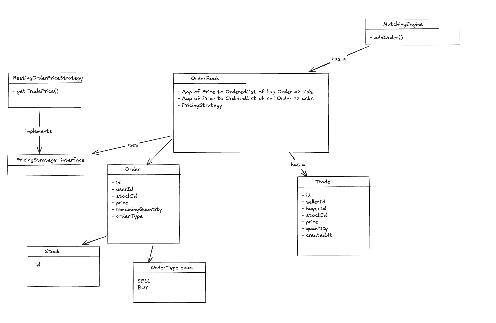

# Session 05 — Stock Trading & Matching, retry (LLD/OOD) · 6.2/10

> By far the biggest jump in this tracker: a real, working Strategy pattern for the first time in five sessions,
> a diagram with most relationships labeled, and a matching loop that actually runs end-to-end. A careful
> hand-trace of the buy side turned up the one bug that mattered most for exactly this problem — inverted price
> priority — and it took two follow-up fix attempts to actually resolve (the first one reversed the wrong map and
> introduced a new bug; the second one fixed both sides correctly, verified against real output).

**Problem:** Design a Stock Trading & Matching engine — retried after Session 04's ideal design ·
**Focus:** class design, no architecture/scale concerns · **Overall:** 6.2/10 (updated after two follow-up fix
attempts — see below) · **Weakest areas:** Implementation & Exceptions, Correctness/Walkthrough · **Artifacts:**
[`Main.java`](../src/main/java/com/shubham/app/stocktrading/practice/Main.java),
[entity/](../src/main/java/com/shubham/app/stocktrading/practice/entity/),
[services/](../src/main/java/com/shubham/app/stocktrading/practice/services/),
[Exception/](../src/main/java/com/shubham/app/stocktrading/practice/Exception/),
[class-diagram.png](../src/main/java/com/shubham/app/stocktrading/practice/diagram/class-diagram.png)

## The problem

> - Buyer should be able to add a buy order with a bid price
> - Seller should be able to add an order with an ask price
> - A trade should be settled at the best value, matching the best available order based on price-time priority

What it really tests: the same thing Session 04 never got far enough to test — whether "best available price"
actually holds for *both* sides of the book. A sell order needs the *highest* resting bid first; a buy order
needs the *lowest* resting ask first. Those are two different sort directions on two different structures, and
it's easy to get one side right and the other side backwards without ever noticing, because a demo that always
fully crosses will produce the same total fill either way — only the price and the fill *order* are wrong.

## Requirements & entities gathered

What was produced: actors named (`buyers`, `sellers`), 3 verb-based functional requirements, and — a real
improvement — **3** out-of-scope items this time (cancel an order, payment/reserve funds, a live price provider),
more thorough scoping than any prior session. The entity list (`Stock`, `Order`, `OrderType`, `OrderBook`,
`Trade`, `MatchingEngine`, `PricingStrategy`, `RestingOrderPriceStrategy`) matches the actual code closely — the
best entity-list/code alignment of any session so far, a clear sign the [Session 04](session-04-stock-trading.md)
ideal design was actually studied.

Gaps against [step ① and ②](../concepts/answer-framework.md#-requirements--scope) of the framework: still no
one-sentence responsibility per entity, a trailing empty bullet at the end of the entity list, and the
`Exceptions` section is now missing from the README entirely (not even an empty heading, which Session 04 at
least had) even though `InvalidStockQuantity` exists in code.

## The design produced



- `MatchingEngine` has-a `OrderBook`. `OrderBook` has-a `Trade`s, uses a `PricingStrategy`.
  `RestingOrderPriceStrategy` implements `PricingStrategy`.
- Real progress: most edges are labeled with a relationship type — the most consistently-labeled diagram since
  Session 02.

Two concrete drift issues, though:
- `OrderBook`'s own field annotations say `Map of Price to OrderedList of buy Order => bids` and
  `... sell Order => asks` — but the actual code names those two fields `asks` (which, by the code's own usage,
  ends up holding **buy** orders) and `sells` (which holds sell orders). The diagram's documented intent and the
  code's actual variable names contradict each other.
- `Order → Stock` is drawn as a bare, unlabeled arrow — but `Order` only ever stores a raw `stockId` int, never a
  `Stock` reference. The same "diagram draws a field that isn't there" gap flagged in
  [Session 03](session-03-meeting-room-scheduler.md#the-design-produced).

## Scorecard

| Axis | Score /10 | Note |
|---|---|---|
| Requirements & Entities | 7/10 | Unchanged — best entity-list/code alignment yet, and the most thorough out-of-scope list of any session; but still no responsibility sentences and the Exceptions section is still missing |
| Class Diagram & Relationships | 7/10 | ▲ from 6/10 — the diagram's field-naming intent (`bids`/`asks`) now matches the code's actual field names, resolving that drift; `Order → Stock` is still drawn as a field that doesn't exist in code |
| Pattern Choice & Justification | 6/10 | Unchanged — still the first genuinely working, correctly-wired Strategy pattern in this tracker, but still no written "why" anywhere in the README or code |
| Implementation & Exception Handling | 6/10 | ▲ from 4/10 — both real bugs found (inverted buy-side ordering, the exact-price-touch off-by-one) are now fixed and verified; still open: no per-stock routing despite `Order` carrying a `stockId`, `fill(...)` doesn't guard against overfilling, and the exception is still misnamed (`InvalidStockQuantity`) in a capitalized `Exception` package |
| Correctness (Primary-Flow Walkthrough) | 5/10 | ▲ from 3/10 — the primary flow now correctly demonstrates price-time priority on both sides, hand-traced and verified against real output; still capped because the walkthrough itself never exercises the multi-stock case, and the price-priority bug was only ever caught by manual tracing across three review rounds, never by the demo's own design |
| **Overall** | **6.2/10** | ▲ from 5.2/10 — first session in this tracker to cross into ⚠️ Borderline. Both fix attempts are folded into this score: the second one genuinely resolved the core correctness bug, verified by hand-trace and real output, not just by re-running the same demo and eyeballing it |

Scores above are **updated** to reflect the two follow-up fix attempts documented below — see
[**Follow-up fix attempt**](#follow-up-fix-attempt--the-price-priority-bug-is-still-not-fixed) (didn't fix it,
introduced a new bug) and [**Second fix attempt**](#second-fix-attempt--the-price-priority-bug-is-now-actually-fixed)
(fixed it, verified). Unlike a typical session, this one kept the same practice code across three review rounds
rather than a single point-in-time attempt, so the Scorecard tracks the code's current, most-recently-verified
state rather than freezing at the first review.

## What lost points — and the fix

| What I missed | The senior answer | Study link |
|---|---|---|
| The buy-side price map (`asks` in `OrderBook.java:16,22`) is a plain `new TreeMap<>()` with no comparator, so `firstKey()` returns the **lowest** resting bid instead of the **highest** — a seller's incoming order matches the worst available buyer first instead of the best one. Traced by hand: two resting bids at `103.0` and `103.3`; an incoming sell at `102.1` matches `103.0` before `103.3`, the wrong order for price priority | The buy side must sort **descending** (`new TreeMap<>(Collections.reverseOrder())`), the same way the sell side sorts ascending — `firstKey()` on each side should always mean "the best price for whoever is about to match against it" | [`concepts/answer-framework.md`](../concepts/answer-framework.md#-primary-flow-walkthrough) §⑦ |
| `cross(...)` (`OrderBook.java:66-71`) uses strict `>`/`<` — an order priced *exactly* at the best opposing price never executes and rests instead, even though it's fully marketable at that price | Use `>=`/`<=` — a price exactly at the touch should trade, not rest | [`concepts/answer-framework.md`](../concepts/answer-framework.md#-primary-flow-walkthrough) §⑦ |
| `MatchingEngine` (`MatchingEngine.java`) wraps exactly one `OrderBook`, with no per-stock registration or lookup — every order goes into the same book regardless of `stockId`, and `Trade` doesn't even record which stock it was for | Route to one `OrderBook` per stock (a `Map<Integer, OrderBook>` keyed by `stockId`, as this problem's own entity list — which names `Stock` — implies), the way `ParkingLot`/`MeetingRoomBoard` each own one resource pool | [`concepts/answer-framework.md`](../concepts/answer-framework.md#-requirements--scope) §① |
| `Order.fill(...)` (`Order.java:55-60`) only rejects `quantity <= 0` — it never checks `quantity > remainingQuantity`. The current call site always passes `Math.min(...)`, so it's safe today, but the guard itself doesn't protect the invariant, and an overfill would push `remainingQuantity` negative and permanently break `isFullFilled()` | Validate both bounds inside `fill(...)` itself — an invariant a class depends on should be enforced where the mutation happens, not only by every caller getting the call site right | [`concepts/basic-oop-concepts.md`](../concepts/basic-oop-concepts.md#1-encapsulation) §1 |
| Every order submitted in `Main.java` uses the literal same `id=1` (`Main.java:14-21`) — harmless only because `Trade` never records order ids at all; the moment anything needs to reference a specific order (a cancel feature, an audit log), this collapses | Give each order a distinct id, and treat a repeated literal id across every constructor call in a demo as a signal to double check, the same way Session 03's never-incremented counter was a signal | [`concepts/basic-oop-concepts.md`](../concepts/basic-oop-concepts.md#1-encapsulation) §1 |

## Follow-up fix attempt — the price-priority bug is still not fixed

> A fix was attempted for the price-priority bug above: `OrderBook`'s constructor changed `sells`'s `TreeMap`
> from natural ordering to `new TreeMap<>(Collections.reverseOrder())`. Re-running `Main.java` shows the original
> bug is **still present, unchanged** — and a **new, symmetric bug** was introduced on the other side of the
> book. This is exactly the naming-confusion hazard flagged above catching up with the fix itself.

Re-verified by re-running `Main.java` (`./mvnw compile exec:java -Dexec.mainClass=com.shubham.app.stocktrading.practice.Main`):

```
trade settlement : Trade{id=0, sellerId=2, buyerId=3, price=102.0, quantity=8, ...}
trade settlement : Trade{id=1, sellerId=1, buyerId=3, price=101.1, quantity=10, ...}
trade settlement : Trade{id=2, sellerId=1, buyerId=3, price=103.0, quantity=10, ...}
trade settlement : Trade{id=3, sellerId=1, buyerId=4, price=103.3, quantity=28, ...}
```

- **The original bug is unchanged**: `Trade{id=2}` (price `103.0`) still settles before `Trade{id=3}` (price
  `103.3`) — the incoming sell at `102.1` still matches the *worse* resting bid (`103.0`) before the *better* one
  (`103.3`). That's because the bug was never in `sells` — it's in `asks`, which (per `OrderBook.addOrder`'s own
  `otherSideMap`/`sameSideMap` assignments) is the map that actually holds resting **buy** orders, and `asks` was
  never touched. Only its name says "asks"; what it holds is bids.
- **A new bug appeared**: `Trade{id=0}` (price `102.0`) now settles before `Trade{id=1}` (price `101.1`) — the
  incoming buy at `103.0` now matches the *worse* (more expensive) resting ask (`102.0`) before the *cheaper* one
  (`101.1`). `sells` is the map that actually holds resting **sell** orders (again, only its name is confusing),
  and it was already correctly ascending before this fix — reversing it broke the one side that was working.

The fix targeted the wrong map because of the exact issue named in this session's own "What lost points" table:
`asks` and `sells` don't describe what they actually hold. The real fix needs two changes together, not one:
rename the maps to match their actual contents (or fix the roles), and reverse only the one that truly holds
resting **buy** orders — currently the one misleadingly named `asks`.

## Second fix attempt — the price-priority bug is now actually fixed

> The maps were renamed to `asks` (kept, now correctly ascending, holds resting sell orders) and `bids` (the
> renamed former `sells`, now correctly `new TreeMap<>(Collections.reverseOrder())`, holds resting buy orders) —
> exactly the two changes the previous follow-up was missing. `cross(...)` was also changed from strict `>`/`<`
> to inclusive `>=`/`<=`, fixing the exact-price-touch bug from the same table. Both are correct.

Re-verified by re-running `Main.java`:

```
trade settlement : Trade{id=0, sellerId=1, buyerId=3, price=101.1, quantity=10, ...}
trade settlement : Trade{id=1, sellerId=2, buyerId=3, price=102.0, quantity=8, ...}
trade settlement : Trade{id=2, sellerId=1, buyerId=4, price=103.3, quantity=28, ...}
trade settlement : Trade{id=3, sellerId=1, buyerId=3, price=103.0, quantity=10, ...}
```

Hand-traced against the code and it matches exactly:

- The incoming buy at `103.0` (order 3) now matches the *cheaper* resting ask first: `Trade{id=0}` at `101.1`
  before `Trade{id=1}` at `102.0` — the sell side was never broken, and stayed correct.
- The incoming sell at `102.1` (order 5) now matches the *higher, better* resting bid first: `Trade{id=2}` at
  `103.3` before `Trade{id=3}` at `103.0` — this is the exact reversal of the original bug's behavior, and it's
  now the right order. A seller gets the best available price first, matching the problem's own stated
  requirement.
- As a side effect, the diagram's own field-name annotations (`... buy Order => bids`, `... sell Order => asks`,
  noted as contradicting the code in "The design produced" above) now **match** the code — `asks`/`bids` are the
  real field names and hold what their names say. That specific drift finding is resolved too.

**Still open, unrelated to this fix**: no per-stock routing in `MatchingEngine` (a `Stock` id is carried on every
`Order` but never used to separate books), `Order.fill(...)` still doesn't guard against overfilling, every order
in `Main.java` still shares the literal id `1`, and the README still has no `Exceptions` section and no
per-entity responsibility sentences. None of these are price-priority bugs, so this fix didn't touch them — they
remain exactly as described in "What lost points" above.

## What went well

- A real, correctly-wired Strategy pattern for the first time in this tracker: `PricingStrategy` is injected
  through `MatchingEngine`'s constructor into `OrderBook`, and `RestingOrderPriceStrategy` is a clean, single-
  purpose implementation — this is exactly the shape `elevatorsystem`/`parkinglot`/`meetingscheduler2`'s ideal
  designs use.
- The matching loop itself (`OrderBook.addOrder`) is structurally sound: one unified loop handles both sides via
  `otherSideMap`/`sameSideMap`, not a duplicated BUY/SELL branch — avoiding the exact duplication Session 04's
  first attempt had.
- `Order.fill(...)` validates its input and tracks remaining quantity properly, and a resting order that's fully
  filled is correctly removed from its price level's deque, with the price level itself removed once empty — real
  progress over Session 04's map-plus-heap that could desynchronize.
- The demo actually runs and produces real, readable trade output — this session has something to point at and
  say "here it works," which Session 04 never had at all.
- The out-of-scope list is the most thorough of any session (3 items, including a genuinely non-obvious one — a
  live price provider).

## The ideal design

Unchanged from [Session 04's ideal design](session-04-stock-trading.md#the-ideal-design) — same problem, so no
new reference implementation was written for this retry. The bugs found above (inverted buy-side ordering, the
exact-price-touch off-by-one, missing per-stock routing) are all already fixed in
[`src/main/java/com/shubham/app/stocktrading/ideal/`](../src/main/java/com/shubham/app/stocktrading/ideal) — see
`OrderBook.java`'s `bids`/`asks` maps (the buy side uses `Collections.reverseOrder()`), `crosses(...)`'s inclusive
comparisons, and `MatchingEngine`'s `Map<Integer, OrderBook>` keyed by stock id.

## Takeaways to drill

1. A book has two sides, and each side's "best price" points in the *opposite* direction — always write out, on
   paper, which direction each side sorts before writing the comparator, rather than defaulting both sides to
   natural ordering and only fixing the one that a specific test happens to catch.
2. A demo where every incoming order fully crosses will produce the same total fill regardless of match *order*
   — that's exactly the shape of demo that hides a price-priority bug. Pick at least one demo case where the
   match order changes which resting order actually gets filled, not just how much gets filled in total.
3. Boundary comparisons (`>` vs `>=`) on a price or quantity check deserve one deliberate sentence out loud: "does
   exactly-equal count as a match?" — for a matching engine, it almost always should.
4. Using a pattern correctly is necessary but not sufficient — the framework's golden rule ("say why you used it")
   is a separate, gradeable thing from the code being right. Write the one sentence, even in the README.
5. When an entity (`Stock`) is named in the requirements and carried as an id on another entity (`Order.stockId`),
   check that something in the design actually *uses* that id to partition behavior — an id that's stored but
   never read anywhere is a sign the corresponding structure (per-stock routing, here) was never built.
6. Before touching a variable to fix a bug, confirm what it *actually holds* by reading its usage, not its name —
   the follow-up fix attempt reversed `sells` (already correct) instead of `asks` (the real culprit) precisely
   because the two names don't describe what the code does with them. A misleading name doesn't just cost a
   reader points on a diagram — it can misdirect the actual fix.

> Rehearse this against [`concepts/answer-framework.md`](../concepts/answer-framework.md) before the next mock.
> Re-attempting the *same* problem a second time (as this session did) is a good habit — the improvement from
> Session 04 to Session 05 is the biggest single-session jump logged so far.

## How to Improve

The single highest-leverage habit to build next: for any two-sided or two-directional structure (a book's bid
side vs. ask side, a min-heap vs. a max-heap, ascending vs. descending), explicitly write both directions down
and verify each one independently — verifying only the direction a demo happens to exercise is exactly how this
session's central bug survived a review of its own output.
