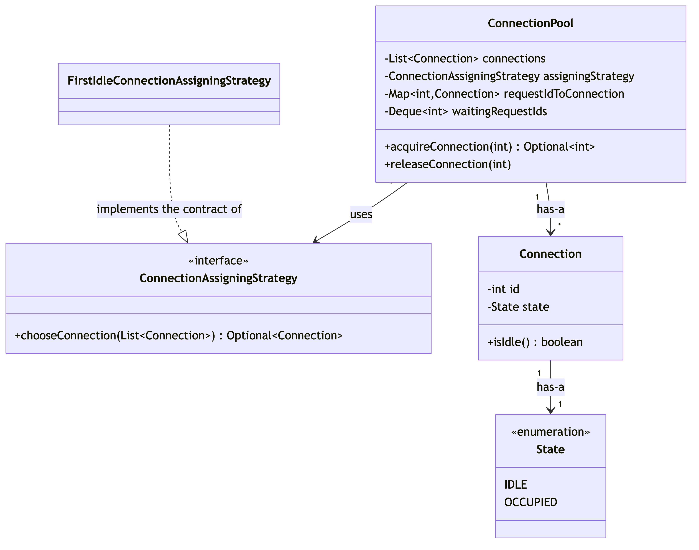
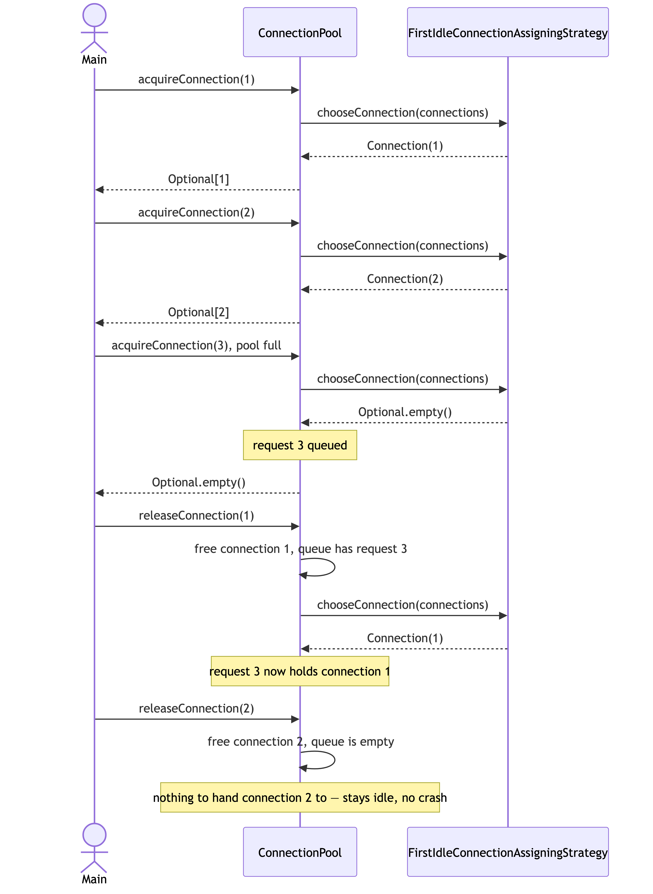

# Session 06 — Connection Pool (LLD/OOD) · 4.6/10

> A real, correctly-wired Strategy pattern continues from Session 05, and the resource-pool entity itself
> (`ConnectionPool`) is the first in this tracker to expose zero raw getters for its internal state. But a
> guaranteed, easily-reproducible crash sits on the *ordinary* release path — releasing a connection when
> nobody's waiting — verified with a two-line scratch test, not an exotic edge case.

**Problem:** Design a Connection Pool · **Focus:** class design, no architecture/scale concerns · **Overall:**
4.6/10 · **Weakest areas:** Correctness/Walkthrough, Implementation & Exceptions · **Artifacts:**
[`Main.java`](../src/main/java/com/shubham/app/connectionpool/practice/Main.java),
[entity/](../src/main/java/com/shubham/app/connectionpool/practice/entity/),
[service/](../src/main/java/com/shubham/app/connectionpool/practice/service/),
[exception/](../src/main/java/com/shubham/app/connectionpool/practice/exception/),
[class-diagram.png](../src/main/java/com/shubham/app/connectionpool/practice/diagram/class-diagram.png)

## The problem

> - Should be able to create a connection pool of fixed size
> - A process should be able to get an idle connection from the pool
> - In case all connections are occupied and a request comes in, the request should be added to a request queue
> - An acquired connection can be released, and the released connection should be assigned to the first process
>   in the request queue

What it really tests: whether "assign the released connection to the first process in the queue" is coded as
"assign it *if* a process is waiting" or "assign it, full stop" — the second version crashes the instant nobody
happens to be waiting, which is the normal state of a healthy pool most of the time, not a rare corner case.

## Requirements & entities gathered

What was produced: a single actor (`Any process` — a reasonable, minimal cut for this problem), 4 clear
verb-based functional requirements that map directly onto the acquire/queue/release mechanic, and an entity list
(`Connection`, `ConnectionStatus`, `ConnectionPool`, `Request`, `ConnectionPoolCreationService`,
`ConnectionAssigningStrategy`, `FirstEmptyConnectionAssigningStrategy`).

Gaps against [step ① and ②](../concepts/answer-framework.md#-requirements--scope) of the framework: **no
out-of-scope section at all** — the first time since Session 01 that zero items were named, after four sessions
of steady improvement on exactly this. The entity list also names `ConnectionStatus`, but the actual enum in code
is called `State` — a naming mismatch between doc and code. And `Request` is listed and has its own class in
code, but nothing in `ConnectionPool` ever uses it — every operation works with a raw `requestId` int directly,
making `Request` a vestigial entity, the same shape of gap as `Stock` in the stock-trading sessions.

## The design produced


- `ConnectionPool` has-a `Connection`s and a `Request`, uses a `ConnectionAssigningStrategy`.
  `FirstEmptyConnectionAssigningStrategy` implements `ConnectionAssigningStrategy`.
  `ConnectionPoolCreationService` creates a `ConnectionPool`.
- Real progress continued: most edges are labeled with a relationship type, following the habit Session 05
  established.

One concrete drift issue: the diagram draws a `ConnectionPoolService` box (with `acquireConnection`/
`releaseConnection` methods) as a completely separate, **unconnected** class — but no such class exists in the
code. Those two methods actually live directly on `ConnectionPool` itself. This is the same "diagram draws a
class that was never built" gap flagged in [Session 04](session-04-stock-trading.md), and the floating,
relationship-free box is the exact "unconnected component" gap flagged all the way back in
[Session 01](session-01-snake-and-ladder.md#the-design-produced).

## Scorecard

| Axis | Score /10 | Note |
|---|---|---|
| Requirements & Entities | 5/10 | Clear, verb-based FRs — but the out-of-scope list vanished entirely after four sessions of steady improvement, plus a doc/code naming mismatch (`ConnectionStatus` vs. `State`) and a fully vestigial entity (`Request`) |
| Class Diagram & Relationships | 5/10 | Most edges labeled, continuing Session 05's habit — but a `ConnectionPoolService` class is drawn floating and unconnected, and it doesn't exist anywhere in the code |
| Pattern Choice & Justification | 6/10 | A second session running with a real, correctly-wired Strategy (`ConnectionAssigningStrategy`/`FirstEmptyConnectionAssigningStrategy`) — but still no written "why" anywhere, and the strategy's own redundant `synchronized` hints at some uncertainty about where the actual concurrency boundary lives |
| Implementation & Exception Handling | 4/10 | `ConnectionPool` itself exposes zero raw getters for its internal maps/queue — a first, real encapsulation win — but `releaseConnection` crashes with a `NullPointerException` on the ordinary "nobody's waiting" release path, `ConnectionPoolCreationService` validates nothing, and `Connection.setId(...)` can desync a connection's identity from its own map key |
| Correctness (Primary-Flow Walkthrough) | 3/10 | The demo runs and shows the queue-then-reassign flow working — but it only ever releases a connection while exactly one request happens to be queued, so it never exercises the ordinary release path where the crash lives |
| **Overall** | **4.6/10** | A real, guaranteed crash on the common case outweighs the genuine encapsulation and pattern-usage gains |

> **Update:** the `releaseConnection` crash (the first row below) was fixed in the practice code — an
> `if (!requestQueue.isEmpty())` guard was added before polling and re-dispatching — while this review was being
> written. Re-verified with the same scratch test used to originally confirm the crash: releasing a connection
> with an empty queue no longer throws. Scores above are left as the record of what this review originally
> found; the other four rows in the table below are still open.

## What lost points — and the fix

| What I missed | The senior answer | Study link |
|---|---|---|
| ✅ **Fixed during this review** — `ConnectionPool.releaseConnection` called `requestQueue.pollFirst()` unconditionally and passed the result straight into `acquireConnection(int)` — on an empty queue, `pollFirst()` returned `null`, and auto-unboxing it threw a `NullPointerException`. Verified with a two-line scratch test: acquire once, release once, with nobody else waiting — it threw every time | Check `!requestQueue.isEmpty()` before polling and re-dispatching — releasing with nobody waiting is the *ordinary* case for a healthy pool, not a rare one. This exact guard is now in the code, re-verified with the same scratch test | [`concepts/answer-framework.md`](../concepts/answer-framework.md#-primary-flow-walkthrough) §⑦ |
| `ConnectionPoolCreationService.createPool` (`ConnectionPoolCreationService.java:11-13`) accepts any `int` pool size, including `0` or negative, with no validation at all — a regression against this repo's own established convention (`ParkingLotCreationService`, `MeetingRoomCreationService` both validate their size argument) | Validate `poolSize > 0` and throw a named exception, the same way every other `*CreationService` in this repo already does | [`concepts/answer-framework.md`](../concepts/answer-framework.md#-exception-handling) §⑥ |
| `Connection.setId(int id)` (`Connection.java:16-18`) lets a connection's id change after construction, while `ConnectionPool` stores every connection under its *original* id as a map key elsewhere — calling it would desync the connection's own id from the key it's actually filed under | Make `id` `final`; nothing after construction should ever need to change a connection's identity | [`concepts/basic-oop-concepts.md`](../concepts/basic-oop-concepts.md#1-encapsulation) §1 |
| `FirstEmptyConnectionAssigningStrategy.getFreeConnection` (`FirstEmptyConnectionAssigningStrategy.java:13`) is independently `synchronized` on the strategy instance — but the actual atomicity already comes entirely from `ConnectionPool.acquireConnection`'s own `synchronized`, which wraps the whole find-and-claim sequence. The strategy's lock protects nothing extra and would become a real, unnecessary bottleneck if one strategy instance were ever shared across multiple pools | Put the lock only where the atomicity guarantee actually needs to live — one `synchronized` boundary per resource pool, not one per collaborator too | [`concepts/answer-framework.md`](../concepts/answer-framework.md#-concurrency--extensibility) §⑧ |
| `Request` (`entity/Request.java`) is named in the entity list and has its own class, but nothing in `ConnectionPool` ever constructs or reads one — every method works with a raw `requestId` int | Cut a class the moment nothing in the design actually uses it — a named-but-unused entity is exactly the same gap as `Stock` in the stock-trading sessions | [`concepts/design-principles.md`](../concepts/design-principles.md#kiss--keep-it-simple) — KISS |

## What went well

- `ConnectionPool` exposes **zero** raw getters for its internal collections (no `getConnections()`, no
  `getRequestQueue()`) — the first resource-pool entity in this entire tracker that doesn't leak a live mutable
  collection, resolving (at least at this level) the multi-session-running "unchecked setters and raw mutable
  getters" recurring item.
- A real, correctly-wired Strategy pattern continues from Session 05: `ConnectionAssigningStrategy` is injected
  through the constructor and used exactly the way `DispatchStrategy`/`SpotAllocationStrategy`/
  `RoomAllocationStrategy`/`TradePricingStrategy` are used in this repo's other ideal designs.
- `acquireConnection` and `releaseConnection` are each one `synchronized` method wrapping their whole
  find-and-claim (or free-and-reassign) sequence — the correct concurrency boundary, matching the fix already
  made once in the parking lot, meeting scheduler, and stock-trading sessions.
- The core happy path — acquire until full, queue an overflow request, release and watch the queue drain — works
  correctly for the one case the demo exercises.

---

## The ideal design

> **Implemented** in [`src/main/java/com/shubham/app/connectionpool/ideal/`](../src/main/java/com/shubham/app/connectionpool/ideal)
> — see that package's own [`README.md`](../src/main/java/com/shubham/app/connectionpool/ideal/README.md) for
> exactly what changed vs. this doc and why.

**Framing sentence:** releasing a connection has two distinct outcomes depending on whether anyone is waiting —
hand it to the next request, or simply let it go idle — and treating "assign it to the first queued request" as
unconditional is the same mistake as treating an `Optional` as if it always has a value.

The rest of this section follows [`concepts/answer-framework.md`](../concepts/answer-framework.md)'s 8 steps in
order, the same structure Sessions 01–05's ideal designs use.

### ① Functional Requirements & Scope

**Actors:** Any process (kept from the practice attempt).

**Operations:** create a fixed-size pool, acquire a connection (or queue the request if none are free), release a
connection — handing it to the next queued request if one exists, otherwise leaving it idle.

**Explicitly out of scope:** connection health checks/validation, connection timeouts, growing or shrinking the
pool at runtime, and sharing one strategy instance across multiple pools (each pool owns its own).

### ② Core Entities & Responsibilities

| Entity | Responsibility |
|---|---|
| `Connection` | id + state; validates nothing needs to change its own id after construction. |
| `State` (enum) | `IDLE` or `OCCUPIED` — no behavior. |
| `ConnectionAssigningStrategy` (interface) | The varying concept: *which* idle connection to hand out. `FirstIdleConnectionAssigningStrategy` is the one implementation. |
| `ConnectionPool` | Owns every `Connection` and the waiting-request queue; the *only* place a connection's state ever changes, always as one atomic step. |
| `ConnectionPoolCreationService` | Builds a `ConnectionPool` of the requested size, validating it first. |
| `InvalidPoolSizeException` / `InvalidRequestIdException` | Name the two distinct failure cases. |

### ③ Relationships & Class Diagram

Named per [`concepts/uml-diagrams.md`](../concepts/uml-diagrams.md#1-class-diagram)'s four categories:

- **Implements the contract of** — `FirstIdleConnectionAssigningStrategy` implements the contract of
  `ConnectionAssigningStrategy` (realization, dashed arrow).
- **Has-a** — `ConnectionPool` has-a `List<Connection>`; `Connection` has-a `State`.
- **Uses** — `ConnectionPool` uses a `ConnectionAssigningStrategy` (a swappable collaborator, not owned state).
- **Is-a** — deliberately absent; the one variation point (which connection to hand out) is a swappable strategy
  behind an interface, per the composition-over-inheritance default in
  [`concepts/basic-oop-concepts.md`](../concepts/basic-oop-concepts.md#2-inheritance) §2.

**Ideal class diagram:** source at
[`diagrams/session06-ideal-class-diagram.mmd`](diagrams/session06-ideal-class-diagram.mmd).



### ④ Pattern Choice & Justification

**Pattern used: Strategy Pattern.**

Put "which idle connection to hand out?" behind an interface, so the calling code can swap the policy without
changing itself — the fifth time this repo has used Strategy for the one policy each problem asks you to name.

- **Connection assignment:** `ConnectionPool` only knows the `ConnectionAssigningStrategy` interface.
  `FirstIdleConnectionAssigningStrategy` is the one implementation today; a round-robin or
  least-recently-used policy is one new class, not an edit to `ConnectionPool`.

### ⑤ Core Classes/Interfaces

Signatures only — full implementations are in
[`src/main/java/com/shubham/app/connectionpool/ideal/`](../src/main/java/com/shubham/app/connectionpool/ideal),
and tests proving each class's behavior are in
[`src/test/java/com/shubham/app/connectionpool/ideal/`](../src/test/java/com/shubham/app/connectionpool/ideal)
(`ConnectionTest`, `ConnectionPoolTest`, `FirstIdleConnectionAssigningStrategyTest`,
`ConnectionPoolCreationServiceTest`):

```java
enum State { IDLE, OCCUPIED }

class Connection {
    Connection(int id);
    boolean isIdle();
}

interface ConnectionAssigningStrategy { Optional<Connection> chooseConnection(List<Connection> connections); }
class FirstIdleConnectionAssigningStrategy implements ConnectionAssigningStrategy { }

class ConnectionPool {
    ConnectionPool(List<Connection> connections, ConnectionAssigningStrategy assigningStrategy);
    Optional<Integer> acquireConnection(int requestId);   // empty => queued
    void releaseConnection(int requestId);
}
```

### ⑥ Exception Handling

- `InvalidPoolSizeException` — thrown by `ConnectionPoolCreationService` for a non-positive pool size.
- `InvalidRequestIdException` — thrown by `ConnectionPool.releaseConnection` for a request that doesn't
  currently hold a connection.
- Edge case handled **without** an exception: releasing a connection when nobody is waiting just leaves it idle —
  that's the fix for this session's bug, not a new error case.

### ⑦ Primary-Flow Walkthrough — the actual fix for this session's bug

Source at
[`diagrams/session06-ideal-sequence-diagram.mmd`](diagrams/session06-ideal-sequence-diagram.mmd).



A 2-connection pool fills up; a third request queues. Releasing the first connection immediately hands it to the
queued request — the practice attempt's demo already covered this case. Releasing the second connection
afterward, with the queue now empty, is the case the practice attempt never tried: it stays idle, with no crash.
See `Main.java`'s demo and the regression test
`ConnectionPoolTest#releasingWithNoWaitingRequestsDoesNotThrow`.

### ⑧ Concurrency & Extensibility

**Concurrency:**
- `ConnectionPool.acquireConnection(...)` and `.releaseConnection(...)` are each one `synchronized` method — the
  find-and-claim (or free-and-reassign) sequence is atomic, the same fix already made for `ParkingLot`,
  `MeetingRoomBoard`, and `OrderBook`.
- The strategy itself holds no lock — the pool's own `synchronized` already covers every call into it.
- A test (`ConnectionPoolTest#concurrentAcquiresNeverDoubleAssignTheSameConnection`) fires more concurrent
  acquires than there are connections and checks that exactly as many succeed as there are connections, with the
  rest correctly queued.

**Extensibility:**
- A new assignment policy → one new `ConnectionAssigningStrategy` implementation, zero changes to
  `ConnectionPool`.
- A new failure case → one new custom exception, following the same naming convention as the two here.

## Takeaways to drill

1. "Assign it to the first request in the queue" is conditional on a request actually being there — read every
   `poll`/`pop`/`remove` call on a queue or deque and ask "what does this return when the queue is empty, and
   what happens to that value next?"
2. A method that validates nothing on its size/count parameter, when every sibling method elsewhere in the same
   codebase validates the equivalent parameter, is a signal worth double-checking before moving on.
3. A lock only protects what's inside its own critical section — if the real atomicity guarantee already comes
   from a caller's lock, an additional lock somewhere else in the call chain isn't adding safety, just cost.
4. An identity field (an id used as a map key elsewhere) should never have a public setter — changing it after
   construction desynchronizes the object from whatever is keyed on its old value.
5. A class that's named in the requirements and given its own file, but never actually constructed or read
   anywhere in the design, is a sign to cut it — the third time this exact gap has shown up in this tracker.

> Rehearse this against [`concepts/answer-framework.md`](../concepts/answer-framework.md) before the next mock.

## How to Improve

The single highest-leverage habit to build next: whenever a demo's last action is "release a resource," add one
more line releasing a *second* resource afterward, when nothing is left waiting for it. That one extra line is
exactly the case this session's crash was hiding behind, and it costs nothing to add.
