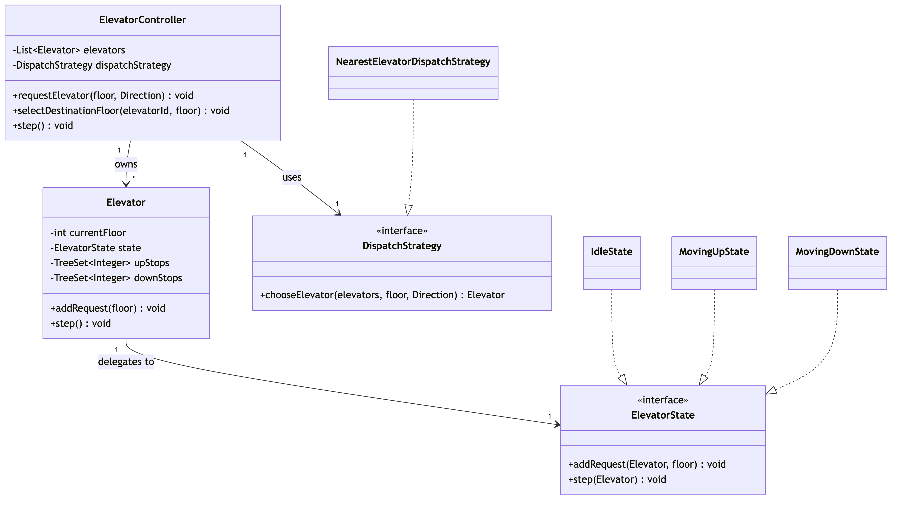
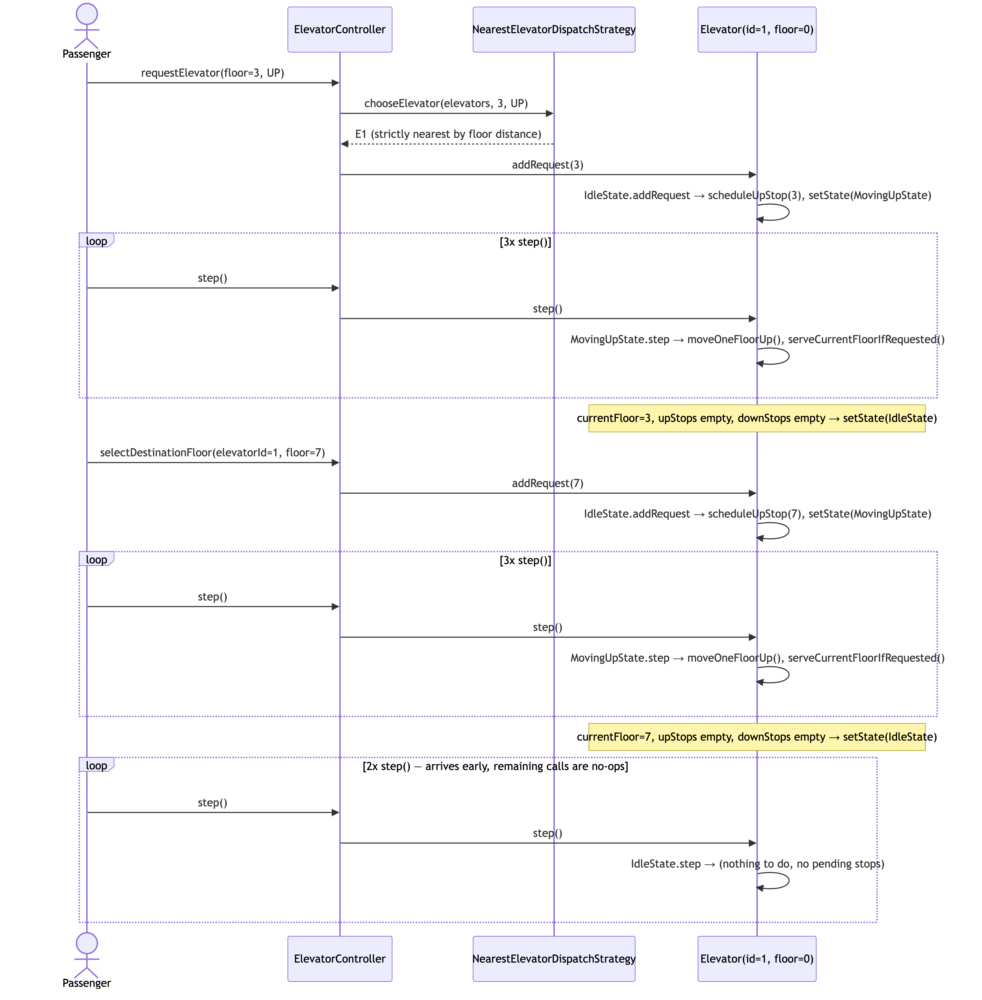

# Elevator System

A worked example of [`concepts/answer-framework.md`](../../../../../../../concepts/answer-framework.md) on a real
problem. Same 8 steps, same order, applied to an actual elevator design.

## Time budget (real 40-minute interview)

A 60-minute interview usually has intro + questions too, leaving about 40 minutes for the design itself:

| Phase | Time | Steps here |
|---|---|---|
| 1. Clarify & identify | ~5 min | ① Requirements & Scope · ② Entities & Responsibilities |
| 2. Model | ~8 min | ③ Relationships & Class Diagram · ④ Pattern Choice |
| 3. Code | ~20 min | ⑤ Core Classes/Interfaces · ⑥ Exception Handling |
| 4. Verify & extend | ~7 min | ⑦ Primary-Flow Walkthrough · ⑧ Concurrency & Extensibility |

## ① Requirements & Scope

**Actor:** Passenger. Just one — no admin/maintenance role.

**What it does:**
- Hall call — press UP or DOWN on a floor. The system picks an elevator to send.
- Cabin call — pick a floor from inside a specific elevator.
- `step()` — move every elevator by one floor. (A real system would drive this from a timer. This demo calls it
  directly so behavior stays predictable and easy to test.)

**Out of scope:** door sensors, weight limits, fire/emergency mode, splitting elevators into separate banks by
floor range.

## ② Entities & Responsibilities

| Entity | Job |
|---|---|
| `Elevator` | Knows its own floor and its pending stops. Does **not** decide direction on its own — that's step ④. |
| `Direction` | Just `UP` or `DOWN`. No behavior. |
| `ElevatorState` | The part that changes by motion mode: idle, moving up, moving down. |
| `DispatchStrategy` | The part that changes by dispatch policy: which elevator answers a call. |
| `ElevatorController` | The entry point. Owns the fleet and the dispatch policy. |
| `InvalidFloorException` | Names the "bad input" case clearly, instead of letting a random exception leak out. |

## ③ Relationships & Class Diagram

- `ElevatorController` **has-a** list of `Elevator`s, and **has-a** `DispatchStrategy`.
- `Elevator` **has-a** current `ElevatorState` — swapped out as it moves. This is *not* inheritance: an elevator
  doesn't become a different subtype, it just points at a different behavior object.
- `Elevator` **has-a** two lists of pending stops, kept private. Nothing outside calls into them directly — they
  go through named methods instead (`scheduleUpStop`, etc.). Why that matters:
  [`basic-oop-concepts.md`](../../../../../../../concepts/basic-oop-concepts.md) §1.
- `IdleState`, `MovingUpState`, `MovingDownState` **implement the contract of** `ElevatorState`.
  `NearestElevatorDispatchStrategy` **implements the contract of** `DispatchStrategy`.

Source: [`diagrams/class-diagram.mmd`](diagrams/class-diagram.mmd)



## ④ Pattern Choice & Justification

- **State** — an elevator behaves differently depending on its mode (idle vs. moving). Three small classes, one
  interface. Adding a fourth mode later (say, "out of service") means adding one class, not editing `Elevator`.
- **Strategy** — "which elevator answers this call" is a policy. Keeping it behind an interface means a smarter
  policy later ("prefer an elevator already heading this way") is also just a new class.

Simple test for both: if the requirement changes, do you *add* a class or *edit* one? "Add" means the pattern
choice was right.

## ⑤ Core Classes/Interfaces

Signatures only — full bodies are in the actual code:

```java
interface ElevatorState {
    void addRequest(Elevator elevator, int floor);
    void step(Elevator elevator);
}

interface DispatchStrategy {
    Elevator chooseElevator(List<Elevator> elevators, int floor, Direction direction);
}

class Elevator {
    void addRequest(int floor);
    void step();
}

class ElevatorController {
    void requestElevator(int floor, Direction direction);   // hall call
    void selectDestinationFloor(int elevatorId, int floor); // cabin call
    void step();
}
```

## ⑥ Exception Handling

- `InvalidFloorException` — thrown for a floor outside the building, or an unknown elevator id.
- Edge case handled **without** an exception: asking to go to the floor you're already on. That's just a no-op,
  not an error.

## ⑦ Primary-Flow Walkthrough

What `Main.java`'s demo actually does:

- 3 elevators, parked at floors 0, 7, and 9.
- Someone on floor 3 presses UP. Elevator 1 (floor 0) is closest, so it gets picked.
- 3 steps later, elevator 1 is at floor 3.
- Someone inside picks floor 7. Elevator 1 moves again and arrives 3 steps later.

Source: [`diagrams/sequence-diagram.mmd`](diagrams/sequence-diagram.mmd)



**What this proves:** the hall call and the cabin call go through the exact same `addRequest(floor)` method.
Nothing had to change to support the second kind of request — that's the class diagram actually paying off.

## ⑧ Concurrency & Extensibility

**Concurrency:**
- `Elevator.addRequest` and `Elevator.step` are `synchronized`.
- Why: two hall calls could arrive on two different threads at the same time. Without a lock, they could corrupt
  the same list of pending stops.
- A test fires 20 hall calls at once from different threads and checks that none are lost.

**Extensibility:**
- A new dispatch policy → one new `DispatchStrategy` class.
- A new elevator mode (e.g. "out of service") → one new `ElevatorState` class.
- Neither needs a change to `ElevatorController` or `Elevator`.
